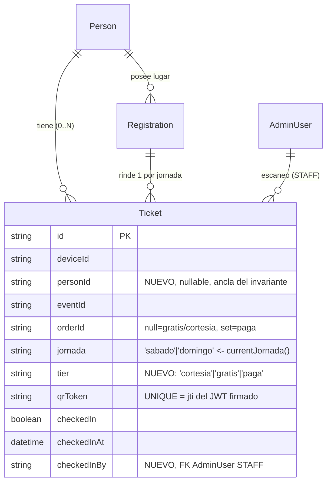
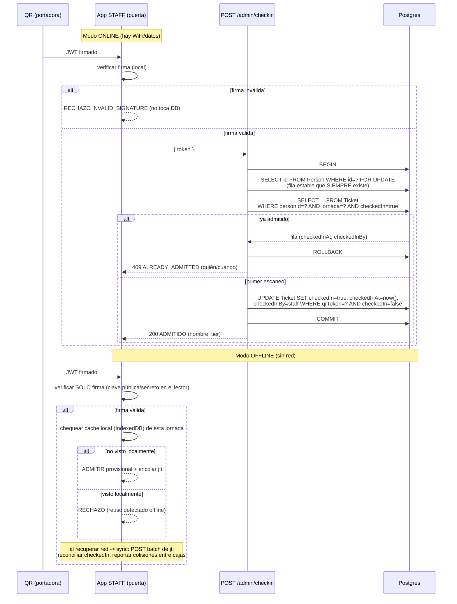
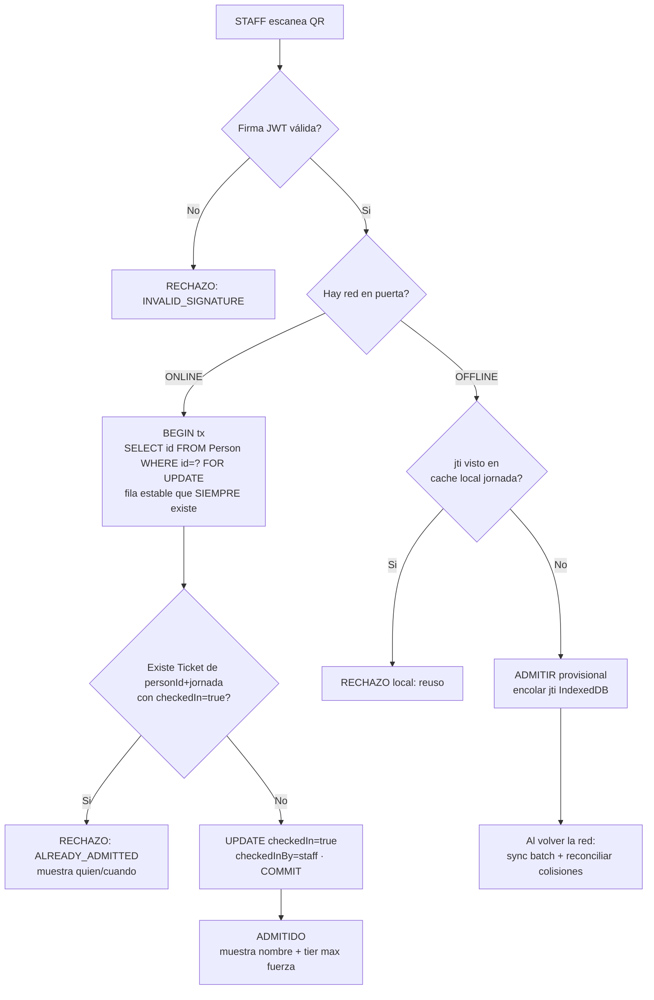

# Addendum del spec — Sistema de admisión y roadmap por fases

**Fecha:** 2026-07-23
**Alcance:** Addendum del spec `2026-07-23-cuentas-otp-publico-design.md`. Consolida en una sola voz dos piezas de diseño (no de implementación): **A.** el sistema de admisión/puerta que resuelve el bloqueante 🔶-B, y **B.** el roadmap de implementación del subsistema de identidad/Person partido en fases. Toda la arquitectura de identidad ya quedó fijada por **D22 / Arquitectura B** (Person = cuenta, `email @unique`); acá no se re-litiga nada de eso: se agrega la capa de puerta encima y se ordena la ejecución.

---

## A. Sistema de admisión (resuelve 🔶-B)

> **Estado:** DISEÑO. La tabla `Ticket` existe en schema y migración (`server/prisma/schema.prisma:423-438`, `server/prisma/migrations/0_init/migration.sql:168-175`) pero es **código muerto**: ninguna línea de `server/src` la escribe ni la lee. Esta sección define cómo pasarla de tabla vacía a portadora real del acceso, sin tocar nada de D22.

### A.1 El invariante: "una admisión por jornada por Person" — y por qué hoy es imposible

**Invariante objetivo:**

> Para cada `Person` P y cada `jornada` J del evento existe **a lo sumo una** admisión consumida. El primer escaneo válido de P para J la admite; cualquier escaneo posterior de P para J se **rechaza** como reúso.

Hoy este invariante **no se puede cumplir por tres razones estructurales**, todas verificadas en código:

1. **La portadora del QR no tiene estado de uso.** El QR lo arma el front con `qrToken()` en `src/lib/identity.ts:151-156`: es un hash determinístico puro del `deviceId` (`hash = hash*31 + charCodeAt`, base36, formato `CCM26-<id>-<hash>`), sin secreto de servidor y sin tocar la DB. Es **falsificable** (función pura del `deviceId`; el propio doc 06 §1.6 lo llama "hash-de-juguete" y advierte que "no debe usarse como mecanismo real de acceso — es demo") y **no-consumible** (no hay columna "usado" ni endpoint que lo marque; una captura de pantalla entra infinitas veces). El comentario en `identity.ts:150` lo vende como "verificable offline", pero sin secreto eso es solo reproducibilidad, no autenticidad.

2. **`Registration` no modela la puerta.** `model Registration` (`schema.prisma:309-324`) tiene exactamente `id, deviceId, eventId, blockId?, status, ts`. Su único enum es `RegistrationStatus` (`confirmada`/`cancelada`). **No** tiene `checkedInAt`, `usado`, `jornada` ni `scannedAt`. Es el registro de "esta persona tiene lugar", no una entrada consumible. Además está atada a `deviceId`, no a `Person` — con lo cual "una por Person" ni siquiera es expresable sobre esa tabla.

3. **No existe superficie de scan.** No hay `POST /admin/checkin` ni `GET /me/accreditation` en `server/src/routes` (grep de `checkin|accreditation|acredit` → 0 rutas). El rol de puerta **STAFF** existe en el enum (`schema.prisma:91-97`) pero está **apagado a propósito**: `adminRoles.ts:58` → `STAFF: []` y no figura en `LOGIN_ENABLED_ROLES` (`adminRoles.ts:72`), con el comentario explícito de que se prende "el día que exista la pantalla de acreditación por QR con su endpoint de check-in" (`adminRoles.ts:66-70`).

**Conclusión:** el invariante requiere (a) una portadora consumible con estado, (b) firmada por el servidor para no ser falsificable, (c) anclada a `Person` + `jornada`, y (d) un endpoint que marque consumo de forma atómica. Nada de eso existe hoy; se construye a continuación.

### A.2 Modelo de datos — decisión: activar `model Ticket` (no extender `Registration`)

**Decisión: se activa `Ticket` como portadora consumible.** Se descarta agregar `checkedInAt`/`checkedInBy`/`jornada` a `Registration`.

**Justificación:**

- La tabla ya existe con exactamente los campos que hacen falta: `jornada` (`schema.prisma:427`), `qrToken @unique` = jti del JWT (`:428`), `checkedIn` + `checkedInAt` (`:429-430`), y el candado `@@unique([deviceId, jornada])` (`:436`), ya migrado en `0_init/migration.sql:168-175` con sus índices (`:464,:467`). Activarla es **cero migración destructiva**: la tabla está vacía.
- **Separación de conceptos.** `Registration` responde "¿tenés lugar?"; `Ticket` responde "¿entraste hoy?". Son ejes distintos: una `Registration` puede rendir dos `Ticket` (sábado + domingo). Meter estado de puerta en `Registration` mezcla cupo con admisión y rompe cuando el evento es multi-jornada.
- `Registration` está anclada a `deviceId`; el invariante es **person-level**. Sobrecargar `Registration` obligaría a refactorizarla igual. Mejor emitir `Ticket` ya anclado a `Person`.

**Cambios aditivos sobre el `Ticket` existente** (todos nuevos, ninguno rompe la tabla vacía):

- `personId String?` + relación a `Person` — el ancla real del invariante bajo Arquitectura B. Nullable transicional (tickets viejos/anónimos), **sin** constraint (mismo criterio que el anti-duplicado de D22: nunca constraint sobre columna nullable person-level).
- `tier String` — **fuente/fuerza** de la entrada: `'cortesia' | 'gratis' | 'paga'`. Alimenta la función de fuerza (§A.5).
- `checkedInBy String?` — FK al `AdminUser` STAFF que escaneó (auditoría de puerta).
- `jornada` pasa a poblarse desde `currentJornada()` en emisión (§A.4 / §A.7).

**El candado del invariante NO es el `@@unique` de tabla.** El `@@unique([deviceId, jornada])` existente (`schema.prisma:436`) es un **backstop device-level**, no el invariante person-level (una Person puede tener varios devices → varios tickets misma jornada). El invariante "una admisión por Person por jornada" se garantiza **transaccionalmente en el scan** (§A.3), exactamente el mismo patrón que ya se usa para el anti-duplicado de registro en D22: chequeo transaccional person-level + backstop unique, nunca constraint sobre `personId` nullable.



**Emisión.** Las 3 fuentes convergen en `confirmarLugar()` (`server/src/services/eventSeats.ts:51`) — gratis vía `registrationService.register()` (`registrationService.ts:26-128`), paga vía `mpWebhookService` → `confirmarLugar(..., 'sobrevender')` (`eventSeats.ts:51-99`), cortesía vía `grantService.reclamarGrant()` → mismo `confirmarLugar` (`grantService.ts:246-249`). Se cuelga la emisión de `Ticket` (firma JWT + fila) en ese embudo, como propone el doc 13 §6 (`13-acreditacion-en-puerta.md:221`): un `Ticket` por `(Person, jornada)` habilitada. **Caso aparte:** la inscripción a bloque tiene rama inline propia en `registrationService.ts:71-96` que no pasa por `confirmarLugar` — se engancha por separado (ver 🔶-B.4).

### A.3 Endpoint de scan — consumo atómico con `SELECT … FOR UPDATE` sobre una fila estable

`POST /admin/checkin` (rol STAFF). Recibe el JWT del QR. El invariante se hace cumplir **dentro de una transacción** que serializa todos los escaneos de la misma Person para la misma jornada.

> **⚠️ Corrección de diseño (P0).** La versión previa del scan lockeaba con
> `SELECT id FROM "Ticket" WHERE personId=? AND jornada=? AND checkedIn=true FOR UPDATE`.
> **Ese lock no serializa nada en el primer escaneo:** al no haber todavía ninguna fila con `checkedIn=true`, el predicado matchea **cero filas** y `FOR UPDATE` no bloquea. Escenario que rompe el invariante: Person P con device D1 (qrToken J1) y D2 (qrToken J2), misma jornada, ambos `checkedIn=false`. Dos cajas escanean en simultáneo J1 y J2 → las dos transacciones ven 0 filas, las dos pasan, cada una hace `UPDATE` sobre su propio `qrToken` (filas distintas, sin conflicto de lock) → **dos admisiones para P la misma jornada**. Ni el CAS por `qrToken` (tokens distintos) ni el backstop `@@unique([deviceId,jornada])` (devices distintos) lo atajan. Es exactamente la trampa que `eventSeats.ts:15-18` documenta: el `FOR UPDATE` debe caer sobre una fila que **siempre existe**, no sobre un predicado condicional que puede estar vacío.

**Flujo corregido:**

```
POST /admin/checkin  { token }   // token = JWT firmado por el servidor
```

1. **Verificar firma** del JWT (siempre, online y offline). Si la firma no valida → `INVALID_SIGNATURE`, ni se toca la DB.
2. Extraer `jti` (= `qrToken`), `personId`, `jornada`, `tier` del payload.
3. `prisma.$transaction`:
   - **Lock sobre fila estable person-level:** `SELECT id FROM "Person" WHERE id = ${personId} FOR UPDATE` — la fila de la Person **siempre existe**, así que el lock serializa de verdad dos lectores de puerta escaneando a la misma Person a la vez (dos cajas, dos devices), análogo al lock de `Event` en `eventSeats.ts:58`. *(Equivalente aceptable: quitar el filtro `checkedIn = true` del SELECT sobre `Ticket` para que bloquee TODAS las filas de `(personId, jornada)`, que sí existen.)*
   - **Recién dentro del lock**, chequear si existe algún `Ticket` de `(personId, jornada)` con `checkedIn=true`. Si existe → **rechazo `ALREADY_ADMITTED`** con quién/cuándo entró (`checkedInAt`, `checkedInBy`).
   - Si no: `UPDATE "Ticket" SET checkedIn=true, checkedInAt=now(), checkedInBy=${staffId} WHERE qrToken=${jti} AND checkedIn=false` y se admite.

> **Caso `personId = null` (ticket anónimo).** El lock person-level no aplica (no hay fila de Person que lockear). Ese caso cae al **backstop device-level** `@@unique([deviceId, jornada])`: la unicidad por device es la única garantía disponible mientras el ticket no esté anclado a Person. Documentado a propósito.

Este es el **mismo molde transaccional ya probado** en el repo: `confirmarLugar()` hace `SELECT id FROM "Event" … FOR UPDATE` antes de contar cupo (`eventSeats.ts:58`, con el comentario `:15-18` que explica por qué el lock es imprescindible cuando dos NULL no colisionan en un índice único); `reclamarGrant()` hace `SELECT id FROM "TicketGrant" … FOR UPDATE` para serializar dos aperturas del mismo link (`grantService.ts:223`); y `adminService.ts` lo repite en múltiples updates (`:108,:129,:168,:230,:381,:494`).

> **Variante a evaluar (§A.7 / 🔶-B.3):** el doc 13 §4.1 (`13-acreditacion-en-puerta.md:182`) propone un **compare-and-swap** sin lock explícito — `UPDATE … WHERE qrToken=${jti} AND checkedIn=false`; si afecta 0 filas → ya usado. Es más simple y suficiente para el candado **device-level**, pero **no** cubre solo el invariante **person-level** (Person con 2 devices = 2 `qrToken` distintos = 1 fila cada uno, ambos CAS afectan 1 fila y pasan). Por eso el diseño usa el `FOR UPDATE` sobre la fila de `Person`, que sí serializa a través de devices distintos. El CAS por `qrToken` queda como segunda barrera dentro del mismo tx.



### A.4 Validación ONLINE vs OFFLINE — según conectividad del Hotel Quinto Centenario

Modelo **híbrido firma+DB** (doc 13 §1.3, `13-acreditacion-en-puerta.md:53-57`), que sobrevive a los dos escenarios:

- **ONLINE** (hay WiFi/datos confiables en puerta): validación completa. Firma **+** estado real en DB (`Ticket.checkedIn`). Garantiza autenticidad **y** un-solo-uso duro. Es el flujo del §A.3.
- **OFFLINE** (sin red): el lector valida **sólo la firma** localmente (la clave vive en el dispositivo), admite provisional, encola el `jti` en IndexedDB y **sincroniza al recuperar red** (doc 13 §4.2, `:184-196`). El chequeo de reúso sólo cubre lo visto por **esa** caja; el doble-uso entre cajas distintas se mitiga con "una sola caja por jornada" o un cache LAN compartido.

**Esto acopla la elección HS256 vs RS256** (doc 13 `:28`, §7 `:232`): si la validación offline corre en varios lectores, se prefiere **RS256** — cada lector lleva sólo la **clave pública** para verificar; el secreto de firma nunca sale del servidor. Con HS256 el secreto compartido tendría que estar en cada dispositivo de puerta (superficie de fuga).

> **🔶 BLOQUEANTE EXTERNO (no resuelto en código):** *relevar la conectividad de la puerta antes del ensayo (~08/09)* — decisión abierta explícita y recurrente en doc 13 §4.2 (`13-acreditacion-en-puerta.md:198`) y heredada en doc 06 §1.6. Define cuánto se apoya la puerta en online vs offline y si vale RS256. Plan B documentado: **lista impresa** de `Ticket` confirmados ordenada por nombre.

**Recomendación de diseño (a confirmar con el relevamiento):**
1. **Asumir peor caso: WiFi de hotel poco confiable.** Diseñar el lector **offline-first**: valida firma siempre, consulta DB **si hay red** (mejor esfuerzo), encola y sincroniza. Nunca bloquear la fila por esperar red.
2. **RS256**, para no repartir el secreto entre lectores.
3. **Una caja por jornada** como norma operativa mientras no haya cache LAN, para que el candado offline (por-lector) coincida con el invariante person-jornada.
4. Tener el **Plan B impreso** listo para el 19-20/09 pase lo que pase.

### A.5 Función de fuerza normalizada sobre las 3 fuentes (dedup de display)

Cuando una misma Person aparece por más de una fuente (p. ej. tomó una cortesía y además figura en un registro gratis), el **display** debe mostrar **una** identidad con la fuente de mayor fuerza. Las 3 fuentes ya convergen en `confirmarLugar()` (`eventSeats.ts:51`) y se materializan en `Ticket.tier`:

- **paga** (VIP / MP): `Ticket.orderId` poblado, `tier='paga'`. Política de sobreventa porque la plata ya se cobró (`eventSeats.ts:20-26, :77-84`).
- **gratis** (inscripción directa): `register()` (`registrationService.ts:26-128`), sólo eventos `price==null`, `tier='gratis'`, `orderId=null`.
- **cortesía** (TicketGrant): `reclamarGrant()` (`grantService.ts:220-255`), `tier='cortesia'`. Cupo ya reservado al otorgar (`schema.prisma:344-346`).

**Orden de fuerza para el dedup — alineado con la recomendación del spec §5.4** (`paga > registration confirmada > cortesía gratis`):

| tier | fuerza | criterio |
|------|:------:|----------|
| `paga` | **3** | pagó: gana siempre en el display |
| `gratis` | **2** | registro abierto confirmado |
| `cortesia` | **1** | invitado por cortesía: la fuente más débil |

> **⚠️ Corrección de diseño (P2).** La versión previa ordenaba `cortesia (2) > gratis (1)`, invirtiendo la recomendación explícita del spec §5.4, que pone la cortesía como **la más débil**. Se corrige para alinear: para una Person con registro gratis + cortesía en la misma jornada, el display muestra **`gratis`** (registration confirmada), no `cortesia`. Así el addendum no queda en contradicción silenciosa con §5.4.

Regla de dedup: para una Person con varios `Ticket` de la misma jornada, el display toma el de **mayor fuerza** (`paga` > `gratis` > `cortesia`).

> **Importante:** la fuerza es **sólo para display/dedup**, **no** para admisión. El invariante de puerta (§A.3) admite **una vez por Person por jornada** sin importar el tier; la fuerza sólo decide **qué etiqueta** se muestra cuando hay solapamiento de fuentes.

### A.6 Rol STAFF para el scan

Se **habilita** el rol de puerta que hoy está apagado a propósito:

- Hoy: `adminRoles.ts:58` → `STAFF: []` (cero permisos) y ausente de `LOGIN_ENABLED_ROLES` (`adminRoles.ts:72`), con comentario explícito de que espera "la pantalla de acreditación por QR con su endpoint de check-in" (`adminRoles.ts:66-70`).
- Diseño: al existir `POST /admin/checkin` (§A.3), STAFF pasa a tener **exactamente un permiso**: `checkin:scan`. Se agrega a `LOGIN_ENABLED_ROLES`. Nada más — STAFF **no** ve pagos, sponsors ni datos de otras superficies; sólo la pantalla de puerta y el endpoint de consumo. `checkedInBy` en cada `Ticket` deja la traza de qué STAFF admitió a quién.

### A.7 Árbol de admisión + sub-decisiones abiertas 🔶



**Sub-decisiones abiertas 🔶 (a cerrar):**

- **🔶-B.1 — Conectividad de puerta (BLOQUEANTE, externo).** Relevar WiFi/datos del Hotel Quinto Centenario **antes del ensayo ~08/09** (doc 13 §4.2, `13-acreditacion-en-puerta.md:198`). Decide online-vs-offline y **HS256 vs RS256**. Recomendación: offline-first + RS256 (§A.4). *Sin este dato, todo lo demás queda con supuesto de peor caso.*
- **🔶-B.2 — Derivación de `jornada` desde `Event`.** **No existe** campo de jornada en `model Event` (`schema.prisma:218-273` tiene `dateLabel`, `startDate`, `timeLabel?`, sin `endDate` ni día-por-día). El vocabulario de jornada (`'sabado'|'domingo'`) vive sólo en `Ticket.jornada` (`:427`) y `TicketPlan.day` (enum `PlanDay`, `:391`). La función `currentJornada()` que asume el doc 13 §3.3 (`:147`) mapea la fecha real contra una **config del evento que hoy no existe**. **Decidir:** agregar campo explícito de jornadas al `Event` (recomendado: array de `{ jornada, fecha }`) vs. derivar heurísticamente de `startDate`/`dateLabel`. Recomendación: campo explícito, para no depender de parsear texto libre.
- **🔶-B.3 — CAS vs FOR UPDATE.** El doc 13 §4.1 (`:182`) propone CAS por `qrToken`; el diseño usa `FOR UPDATE` sobre la fila de `Person` porque el invariante es person-level y el CAS por token no serializa entre devices distintos de la misma Person (§A.3). Confirmar que se acepta el costo del lock (marginal a escala de una puerta).
- **🔶-B.4 — Rama de inscripción a bloque.** `register()` a bloque no pasa por `confirmarLugar` (rama inline `registrationService.ts:71-96`); hay que enganchar emisión de `Ticket` ahí por separado. Confirmar si los eventos con bloques emiten ticket de puerta o sólo los de nivel-evento.
- **🔶-B.5 — Backstop `@@unique([deviceId, jornada])`.** Se conserva (`schema.prisma:436`) como segunda barrera device-level y como única garantía en el caso `personId = null` (§A.3), pero **no** es el invariante person-level. Confirmar que no genere falsos rechazos cuando una Person legítima re-escanea desde otro device (el `FOR UPDATE` sobre `Person` ya la ataja antes; el unique sólo dispara en el mismo device).

**Archivos de grounding:** `server/prisma/schema.prisma` (Ticket `:423-438`, Registration `:309-324`, Event `:218-273`, roles `:91-97`), `server/prisma/migrations/0_init/migration.sql:168-175`, `server/src/services/eventSeats.ts:15-18,51,58`, `server/src/services/registrationService.ts:26-128`, `server/src/services/grantService.ts:220-255`, `server/src/domain/adminRoles.ts:58,66-72`, `src/lib/identity.ts:150-156`, `work-agent/backend/13-acreditacion-en-puerta.md`, `work-agent/backend/06-auth-identidad-seguridad.md`.

---

## B. Roadmap de implementación por fases

> Parte el §13 (14 pasos) en 8 fases coherentes. Resuelve la observación *"es un subsistema grande, partir en fases"*.
> **Decisiones ya cerradas (no se relitigan):** Arquitectura B (Person=cuenta, `email @unique`); D22 intacto; área personal `person-scoped` vía `scopeToPerson` blindando `personId=null`; invariante *escribir un email nunca da acceso — único gate = OTP o ser creador*; motor OTP reusado (`adminOtp.ts`) con `OtpChallenge` + `purpose='device_link'`; anti-duplicado = chequeo transaccional person-level + backstop device-unique (sin constraint sobre `personId` nullable). **Los datos NO se re-enraízan** — §3, §6.6, §7.2, §7.3: se quedan físicamente en `Device.id` y se leen uniendo por Person; los `@@unique` quedan como backstop por-device.

### Regla dura del release (innegociable)

> **⚠️ Corrección (P1).** El bundle atómico deja de ser `{5,7,11}` por dos motivos independientes:
> 1. **El paso 7 pierde su migración destructiva.** El entregable original decía "re-key de `Membership`/`Registration` de device→person (migración de re-keying; toca el webhook de pago)". Eso **contradice una decisión cerrada del spec** (§3, §6.6, §7.2, §7.3): los datos **no** se re-enraízan. El paso 7 real (§9.3) es sólo pre-check person-level en checkout + `becomeSocio` person-level + gate `socioOnly` person-level, **leyendo por unión de devices, sin re-key**. Al desaparecer la migración, 7 ya no necesita estar en el co-deploy atómico: viaja como los otros reads person-scope (6/8/10), dependiente del gate (5) desplegado.
> 2. **El paso 9 (§9.5) entra al bundle atómico.** §7.4 paso 3 hace que la seguridad del grandfathering del backfill **dependa de §9.5**: un device single-device grandfathereado con `linkVerifiedAt=null` puede haber tipeado un email ajeno; por eso las acciones sensibles exigen OTP aunque sea DUEÑO. Si el backfill (11) grandfatherea **antes** de que exista el gate del paso 9, un device que tipeó el email de un tercero obtiene acceso sensible sin OTP — exactamente el agujero que §9.5 cierra. Por lo tanto **9 debe co-deployarse CON el backfill o ANTES**, nunca después.

**El co-deploy atómico es `{5, 9, 11}`, en este orden dentro del mismo deploy: gate de identidad (5) → gate de acciones sensibles por `linkVerifiedAt` (9) → reconciliación del backfill (11).** El backfill NO puede shippear antes que el gate de identidad **ni** antes que el gate de acciones sensibles. Shippear 5 sin el backfill orfaniza a las Personas multi-device; shippear el backfill sin 9 abre el agujero de §7.4 paso 3. Anclado en §13.11 + §7.4 paso 3 (§9.5) + memorias `ccm_backfill` y `auditar_prod_solo_lectura` (auditar prod = SOLO GET). *(El paso 7 ya no forma parte del bundle: se degrada a read person-scope post-gate.)*

### Fases

#### F0 — Documental
- **Pasos:** 1
- **Entregable:** PRD §7 / D22 / D15 / §7.5 actualizados en `PROJECT.MD`, `docs/`, `work-agent/*.md`.
- **Desbloquea:** alineación de todo el subsistema; nada de código depende de F0, pero fija el contrato conceptual.
- **Riesgo:** Bajo.
- **Shippable solo:** **Sí.** Puede salir sola en cualquier momento.

#### F1 — Fundaciones OTP (raíz)
- **Pasos:** 2 (raíz) ‖ 3 (template mail)
- **Entregable:** modelo `OtpChallenge` + `Device.linkVerifiedAt` (migración aditiva), capa de datos email+purpose, `hashOtp` con `purpose`; template `deviceLinkOtpEmail`.
- **Desbloquea:** TODO. Es la raíz del grafo: sin motor OTP no hay endpoints (4), no hay gate (5), no hay acciones gateadas (9).
- **Riesgo:** **Medio** (migración + cripto del hash con purpose).
- **Shippable solo:** **Sí.** Sale aditivo y dormido (nadie lo consume todavía). 3 y 2 corren en paralelo; 3 solo bloquea a 4.

#### F2 — Superficie de vinculación
- **Pasos:** 4 (endpoints `/devices/link/request` + `/verify`) ‖ 5 (gate en `linkPerson`/`deviceService.ts:47`)
- **Entregable 4:** anti-enumeración (`{ok:true}`), `INVALID_CODE`, precondición Device, 409 en reasignación, seteo `personId`+`linkVerifiedAt`, device-token, 2 limiters (IP+email) + cerco DB.
- **Entregable 5:** `linkPerson` pasa de `string | null` a `LinkResult` tipado, predicado *"cuenta recuperable"* con `Application`, Rama B (compra device-scoped + unificación opcional).
- **Desbloquea 5:** todo el dominio person-level (6, 7, 8, 10, 13) y habilita el backfill (11).
- **Desbloquea 4:** acciones gateadas (9) y todo el front (12).
- **Riesgo:** **Alto** en ambos. 4 = mayor riesgo *aislado* (seguridad/limiters/reasignación). 5 = núcleo de identidad, blast radius grande.
- **Shippable solo:** 4 **ships pero inerte** sin el front (12) que lo consume. 5 **NO** — está atado al co-deploy con 11.
- **Coordinación clave:** definir/stubbear la firma `LinkResult` primero, porque 4 consume el `LinkResult` de 5 (acoplamiento suave). 4 y 5 corren en paralelo una vez firme esa firma.

#### F3 — Dominio person-level
- **Pasos:** 7 ‖ 6 ‖ 8 ‖ 10
- **Entregable 7 (corregido, P1):** membresía person-level **sin re-key** — pre-check transaccional en el checkout (§9.3), `becomeSocio` a nivel Person y gate `socioOnly` person-level **leyendo por unión de devices**. Los datos siguen colgados de `Device.id`; el webhook de pago (`mpWebhookService.ts`) **no re-enraíza filas**. *(Se elimina toda "migración de re-keying" del entregable y del riesgo.)*
- **Entregable 6:** middleware `scopeToPerson` + blindaje `personId=null` + reads `groupBy` (arrancar por postulaciones → `personId`).
- **Entregable 8:** consents person-level en escritura + auditar `statsService`.
- **Entregable 10:** grant blast-radius (🔶-C) en `grantService.ts`.
- **Desbloquea:** admisión (13) necesita 7 (membresía person-level para su pre-check). 6/8/10 son hojas del abanico.
- **Riesgo:** **Medio** en los cuatro. *(7 baja de "Alto" a "Medio": al no re-enraizar ni tocar el camino de pago, deja de ser una migración destructiva y pasa a ser un read/gate person-level más.)*
- **Shippable solo:** **No.** 6, 7, 8 y 10 dependen del gate (5) desplegado, así que viajan con o después del release atómico. Ninguno queda atado al bundle: son reads person-scope post-gate.
- **Paralelizable:** 6, 7, 8, 10 son independientes entre sí.

#### F4 — Front
- **Pasos:** 12 (front)  *(9 se relocaliza al bundle atómico F5 — ver Regla dura y F5)*
- **Entregable 12:** `clearProfile`, logout blindado, modal login/OTP, rotación de token + `GET /me`, 3er estado *Mi QR*, captura dni-only. Toca `identity.ts`, `api.ts`, `actions.ts`, `MiQR.tsx`, `SiteLayout.tsx`.
- **Nota sobre 9:** el paso 9 (acciones sensibles gateadas por `linkVerifiedAt`, §9.5) se **desarrolla** junto a 12 (ambos dependen de 4 desplegado) pero **ya no shippea diferido en paralelo**: su binding de release es el **bundle atómico** (§F5). Ver corrección P1.
- **Desbloquea:** cierra la cadena de UX de vinculación; hace usable lo que 4 dejó inerte.
- **Riesgo:** Medio.
- **Shippable solo:** **No.** 12 depende de 4 desplegado.

#### F5 — Migración (RELEASE ATÓMICO) 🔴
- **Pasos:** **11 (backfill) co-deploy con 5 + 9 — GATE(5) → GATE-SENSIBLE(9) → BACKFILL(11)**
- **Entregable:** auditoría read-only BLOQUEANTE (solo GET) → reconciliación por clave → 1 device/Person multi-device. Corre en el mismo deploy que el gate de identidad (5) y el gate de acciones sensibles (9), con **5 y 9 aplicados antes** del backfill.
- **Desbloquea:** deja la data prod consistente con el modelo person-level. Es el punto sin retorno.
- **Riesgo:** **Alto** (migración prod; memoria `auditar_prod_solo_lectura`: la auditoría es SOLO GET, jamás POST).
- **Shippable solo:** **No — por definición.** Es un co-deploy forzado `{5,9,11}`. Shippear el backfill antes que el gate de identidad orfaniza Personas; shippear el backfill sin el gate de acciones sensibles (9) abre el agujero de §7.4 paso 3.

#### F6 — Admisión (paralela / diferible)
- **Pasos:** 13 (🔶-B, subsistema nuevo: services + routes + front) — el detalle completo es la **Sección A** de este addendum.
- **Entregable:** sistema de admisión completo (§A).
- **Desbloquea:** feature de producto propia; no desbloquea a nadie del fix de seguridad.
- **Riesgo:** **Alto** (subsistema grande) — pero aislado.
- **Shippable solo:** **Sí**, como feature propia, una vez firmes 5 y 7. **No está en el critical path del fix de seguridad** → candidata a diferir sin bloquear el release. Se desarrolla en rama propia.

#### F7 — Testing (transversal)
- **Pasos:** 14
- **Entregable:** tests por capa (TDD junto a cada paso) + suite de integración end-to-end.
- **Desbloquea:** el gate de calidad del release.
- **Riesgo:** Medio.
- **Shippable solo:** N/A — es transversal. Cada capa se escribe con su paso; solo la suite de integración end-to-end depende del release completo.

### Critical path y paralelismo

**Critical path (actualizado, P1):** `F1(2) → F2(5) → F5({5,9,11} atómico) → F7(14)` — motor OTP → gate de identidad → release atómico (gate identidad + gate acciones sensibles + backfill) → verificación. Es la columna vertebral de seguridad + datos. *(El paso 7 sale del critical path: al perder la migración, deja de ser predecesor del backfill y pasa a ser un read person-level post-gate que alimenta la admisión.)*

**Segunda cadena (converge en 14):** `F2(4) → F4(12)` — superficie de vinculación + front. Y `F2(4) → 9 → F5` — el gate de acciones sensibles entra al bundle atómico.

**Corre en paralelo:**
- **Fundaciones (arrancan ya):** F0(1), F1(2 raíz), F1(3). 3 y 1 no bloquean a nadie salvo 3→4.
- **Tras 2:** 4 y 5 en paralelo (coordinar la firma `LinkResult` primero, o stubbearla).
- **Tras 5 (abanico):** 6, 7, 8, 10 y 13 independientes entre sí. *(7 ahora vive acá, no en el critical path.)*
- **Tras 4:** 9 y 12 en paralelo (mismo predecesor); 9 se reserva para el bundle atómico, 12 shippea con el front.
- **13 (admisión):** la feature más aislable → diferible sin bloquear el release de seguridad.
- **14:** por capa junto a cada paso (TDD); solo integración end-to-end espera el release completo.

### Diagrama de dependencias entre fases

```mermaid
flowchart TD
    F0["F0 · Documental<br/>(1)"]
    F1a["F1 · Motor OTP RAÍZ<br/>(2)"]
    F1b["F1 · Template mail<br/>(3)"]
    F2a["F2 · Endpoints link<br/>(4)"]
    F2b["F2 · Gate linkPerson<br/>(5)"]
    F3a["F3 · Membresía person-level SIN re-key<br/>(7)"]
    F3b["F3 · scopeToPerson + reads<br/>(6)"]
    F3c["F3 · Consents person-level<br/>(8)"]
    F3d["F3 · Grant blast-radius<br/>(10)"]
    F4a["F4/F5 · Acciones sensibles gateadas<br/>(9) · entra al bundle atómico"]
    F4b["F4 · Front login/OTP<br/>(12)"]
    F5["F5 · RELEASE ATÓMICO<br/>co-deploy 5+9+11 · GATE(5)→GATE-SENSIBLE(9)→BACKFILL(11) 🔴<br/>(11)"]
    F6["F6 · Admisión (diferible)<br/>(13) = Sección A"]
    F7["F7 · Testing end-to-end<br/>(14)"]

    F1a --> F2a
    F1b --> F2a
    F1a --> F2b
    F2b -.->|firma LinkResult| F2a

    F2b --> F3a
    F2b --> F3b
    F2b --> F3c
    F2b --> F3d
    F2b --> F6
    F3a --> F6

    F2a --> F4a
    F1a --> F4a
    F2a --> F4b

    F2b --> F5
    F4a --> F5
    F1a --> F5

    F5 --> F7
    F4b --> F7

    %% Critical path resaltado
    linkStyle 2 stroke:#d62828,stroke-width:4px
    linkStyle 15 stroke:#d62828,stroke-width:4px
    linkStyle 16 stroke:#d62828,stroke-width:4px
    linkStyle 18 stroke:#d62828,stroke-width:4px

    classDef crit fill:#fde8e8,stroke:#d62828,stroke-width:3px,color:#000;
    classDef atomic fill:#fff3cd,stroke:#d62828,stroke-width:3px,color:#000;
    class F1a,F2b,F4a,F7 crit;
    class F5 atomic;
```

*(Líneas rojas gruesas = critical path `2→5→{5,9,11}→14`. Nodo amarillo con borde rojo = F5, release atómico gate-primero, ahora con 9 dentro del bundle. La flecha punteada `5 ⇢ 4` es el acoplamiento suave de la firma `LinkResult`. El paso 7, sin re-key, cuelga de 5 y alimenta la admisión (13), fuera del critical path.)*

### Tabla resumen

| Fase | Entregable | Desbloquea | Riesgo | Shippable solo |
|------|-----------|-----------|--------|----------------|
| **F0** Documental (1) | PRD §7, D22, D15, §7.5 en docs | Alineación conceptual del subsistema | Bajo | **Sí** |
| **F1** Fundaciones OTP (2‖3) | `OtpChallenge` + `Device.linkVerifiedAt` + hash con purpose; template mail | TODO (raíz): 4, 5, 9 | Medio (migración+cripto) | **Sí** (aditivo, dormido) |
| **F2** Superficie de vinculación (4‖5) | Endpoints link (anti-enum, limiters, 409) ‖ Gate `LinkResult` en `linkPerson` | 5→dominio person-level + backfill; 4→acciones+front | **Alto** (4 aislado, 5 sistémico) | 4: inerte sin 12. 5: **No** (co-deploy `{5,9,11}`) |
| **F3** Dominio person-level (7‖6‖8‖10) | Membresía person-level **sin re-key** (pre-check checkout, becomeSocio, socioOnly leyendo por unión) ‖ scopeToPerson ‖ consents ‖ grant | Admisión (13) vía 7 | Medio en los 4 (7 ya no es migración) | **No** (dependen del gate 5 desplegado; reads post-gate) |
| **F4** Front (12) | Front login/OTP/`me`/rotación/3er estado. *9 se desarrolla acá pero shippea en el bundle atómico* | Cierra UX de vinculación | Medio | **No** (12 depende de 4 desplegado) |
| **F5** Migración 🔴 (11) | Backfill: auditoría read-only → reconciliación → 1 device/Person, co-deploy con 5 y 9 | Data prod consistente; punto sin retorno | **Alto** (migración prod, solo GET) | **No — co-deploy `{5,9,11}`: gate(5)→gate-sensible(9)→backfill(11)`** |
| **F6** Admisión (13) | Subsistema admisión (Sección A: services+routes+front) | Feature de producto (no bloquea seguridad) | Alto (aislado) | **Sí** (tras 5/7; diferible, rama propia) |
| **F7** Testing (14) | Tests por capa (TDD) + integración end-to-end | Gate de calidad del release | Medio | N/A (transversal; integración espera release completo) |