# Spec — Cuenta por Persona (Arquitectura B): identidad person-scoped, recuperación por OTP y logout sin muro

**Proyecto:** CCM-seed (`/Users/alannaimtapia/dev/ccm-seed`)
**Fecha:** 2026-07-23
**Estado:** Diseño consolidado — listo para revisión de implementación. No contiene código de implementación.

---

## 1. Contexto

Hoy CCM opera bajo el invariante D22 / PRD §7: **"el dispositivo ES la cuenta, sin login ni logout"**. En el front, `ensureDevice()` acuña un `deviceId` local en la primera visita, silenciosamente (`src/lib/identity.ts:52-60`), y el backend firma un device-token HMAC de larga vida (`src/lib/deviceToken.ts:8-18`). Todos los activos del asistente —entradas, órdenes, inscripciones, membresía, perfil, consentimientos— cuelgan del **Device**, y el área personal (Mi QR, Mis entradas, perfil) se lee filtrando por `req.deviceId`.

Ese modelo tiene un límite estructural: **un asistente que cambia de teléfono, o que borra datos del navegador, pierde el acceso a todo lo suyo**, porque su identidad vivía atada a un `deviceId` irrecuperable. El PRD §7.5 ya anticipaba una Fase 1 de "unificación entre dispositivos" vía email.

La base de datos ya trae la pieza que hace posible resolver esto sin re-arquitecturar: el modelo `Person` con `email String? @unique` y `dni String? @unique` (`server/prisma/schema.prisma:189-190`), y `Device.personId String?` con `onDelete: SetNull` e índice (`schema.prisma:168-172`). O sea: **un email = una sola Person**, y `Device.personId` es la arista que puede unir varios dispositivos bajo una misma cuenta. Falta activarla.

---

## 2. Problema

`Device.personId` **se escribe hoy pero no se lee en ningún lado para expandir acceso** (grounding person-linkperson (a)): es una back-reference de CRM, no un mecanismo de login. Se setea en dos rutas:

1. `services/deviceService.ts:46-47` (`saveFields`): **incondicionalmente** — cualquier email/dni tipeado que matchee una Person existente engancha el dispositivo a esa Person, sin ninguna prueba de posesión.
2. `services/grantService.ts:245` (`reclamarGrant`): gateado por el token HMAC del link del grant (`verificarTokenGrant`, `:230`).

El día que se activen las **lecturas person-scoped** (unir los datos de todos los devices de la Person), ese enganche incondicional del punto 1 se convierte en **robo de identidad**: un dispositivo nuevo que tipea el email de otra persona pasaría a ver sus entradas, su membresía y su PII.

El problema, entonces, es doble:

- **De producto:** dar recuperación de cuenta cross-device (login/logout) **sin romper D22** (sin muro, fricción cero para entrar al sitio).
- **De seguridad:** que expandir el acceso a nivel Person no abra puertas de robo de identidad; que el único gate de acceso sea la posesión del email probada por OTP.

---

## 3. Decisiones acordadas (con su stress-test)

Estas decisiones vienen cerradas con el usuario. Se groundean y se stress-testean; **no se re-litiga la arquitectura**. Donde el stress-test encontró un borde que las decisiones no cubrían, se resuelve **dentro** de la decisión (nunca proponiendo otra arquitectura), y se marca 🔶 si queda una elección pendiente.

1. **Arquitectura B — Person ES la cuenta.** Un email = una Person (`Person.email @unique`, `schema.prisma:189`). `Device.personId` ya existe (`:168`).

2. **D22 se mantiene: nunca hay muro.** Entrar al sitio público es fricción cero. Sólo el **área personal** (Mi QR, Mis entradas, perfil, membresía, postulaciones) pasa de device-scoped a **person-scoped** = unión de los dispositivos de la Person. **Los datos NO se re-enraízan:** se quedan físicamente en `Device.id` y se leen uniendo por Person.

3. **Tres estados del dispositivo:** ANÓNIMO (fresh o post-logout), DUEÑO (creó los datos con email nuevo → acceso sin OTP), AUTENTICADO (verificó el email por OTP → otro dispositivo o vuelta post-logout).

4. **Invariante de seguridad:** `Device.personId` con acceso person-scoped se setea **solo** si el device es DUEÑO (creó los datos) o AUTENTICADO (pasó OTP). Escribir un email en un formulario **nunca** da acceso por sí solo.

5. **Registro/compra con email NUEVO (sin cuenta recuperable previa):** silencioso, sin OTP. Es el happy path.

6. **Registro/compra con email que YA tiene cuenta recuperable:** como `Person.email @unique` no deja crear una segunda, aparece OTP (única excepción a "registro sin OTP"). *Stress-test que redefine el predicado, ver §5.1 y 🔶-A:* "cuenta recuperable" **no** es sólo "tiene activos de ticketing" — incluye postulaciones y PII, porque hoy el 100% de la población real (24 Persons) viene de postulaciones y no tiene activos de ticketing; con la definición estrecha el gate nunca dispararía.

7. **Cerrar sesión:** puramente client-side (borra device-token + perfil local → `ensureDevice()` acuña un device anónimo fresco). **Server-side no se borra nada.** "Cerrar sesión en todos lados" con revocación = YAGNI, fuera de alcance. *Riesgo residual aceptado documentado en §9.6.*

8. **Iniciar sesión / recuperar en otro dispositivo:** email → `request-otp` (siempre `{ok:true}`, anti-enumeración) → código al mail → `verify-otp` → ata ESTE device a la Person y marca verificado → lecturas person-scoped.

9. **Reusar el motor OTP existente** (`server/src/lib/adminOtp.ts`) con un propósito nuevo, sin duplicar el motor puro. *Resuelto en §6.1: tabla dedicada `OtpChallenge` (no se toca `AdminLoginCode`), y **un solo `purpose='device_link'`** para todo el flujo público.*

10. **Cambio delicado en `linkPerson()`:** condicionar el seteo de `personId` — auto-vincular con acceso solo si el email es nuevo/sin dueño; si ya tiene cuenta recuperable, disparar el gate OTP.

11. **Bordes:** Mi QR agrupa por jornada (muestra la más fuerte: VIP paga > gratis). Membresía = socia si ALGUNA device tiene membresía activa; al comprar chequear a nivel Person. El DNI sirve para CRM/unificación pero **jamás** da acceso; el único gate es el email por OTP.

**Sustituciones respecto del PRD (para que nadie espere lo que el diseño deliberadamente no hace):**
- PRD §7.5 dice "magic link que mergea identidades". El diseño usa **OTP de 6 dígitos** (no magic link) y **une por Person sin fusionar filas** (los datos se quedan en su `Device.id`; `personService` nunca fusiona Persons, `:47-48`). Hay que actualizar PRD §7.5 en consecuencia.
- PRD §7.1/§7.3 y la fila D22 dicen "sin login/logout" y D15 "un dispositivo = un perfil". El modelo evolucionado los **supera**: la identidad sigue sin muro y sin contraseña, y se agrega recuperación opt-in por email y un "cerrar sesión" que **sólo desvincula este dispositivo**. Hay que actualizar PRD §7 y la fila D22 para que un futuro guardián no revierta la feature "por violar D22" (🔶-J).

---

## 4. Arquitectura de identidad y cuenta

### 4.1 Person es la cuenta; los datos no se re-enraízan

`Person` **no cuelga activos de negocio directamente** (`schema.prisma:185`): sus relaciones son `devices Device[]`, `applications Application[]`, `grants TicketGrant[]` y `Payment.person`. Todo lo demás vive colgado del **Device**:

- `Registration.deviceId` (`schema.prisma:309`), portadora del QR
- `TicketOrder.deviceId` (`schema.prisma:400`, nullable)
- `Membership.deviceId @unique` (`schema.prisma:718`)
- `ProfileField` con `@@unique([deviceId,key])` (`schema.prisma:210`)
- consentimientos como columnas de `Device` (`consentTerms/News/Sponsors`, `schema.prisma:147`)
- `Ticket.deviceId` (`schema.prisma:423`, **hoy sin uso** en routes/services)
- `TicketGrant.personId` **directo** (`schema.prisma:355`) y `Application.personId` (`schema.prisma:859-886`) — estos dos ya nacen person-scoped

La cuenta se arma **leyendo por unión**: se resuelve la Person del device actual y se juntan los datos de todos sus devices. No se migran filas para colgarlas de `Person`.

### 4.2 `Device.personId`: la arista de acceso

`Device.personId` es la única arista que junta varios dispositivos bajo una cuenta. El corazón de esta arquitectura es **convertir esa columna (hoy back-reference de CRM) en el mecanismo de acceso person-scoped**, sin aflojar la puerta de entrada al sitio, y **gateando su escritura** para que sólo se setee cuando el device es DUEÑO o AUTENTICADO.

### 4.3 Los tres estados del dispositivo

| Estado | Cómo se llega | `Device.personId` | `Device.linkVerifiedAt` | Acceso person-scoped |
|---|---|---|---|---|
| **ANÓNIMO** | fresh (`ensureDevice()`, `identity.ts:52-60`) o post-logout | `null` | `null` | No (solo lo que creó este device) |
| **DUEÑO** | registro/compra con email **sin cuenta recuperable previa** | seteado | `null` | Sí |
| **AUTENTICADO** | verificó el email por **OTP** | seteado | seteado | Sí |

**`linkVerifiedAt` tiene consumidor real (no es sólo auditoría):** las **acciones sensibles** exigen `linkVerifiedAt != null` aunque el device sea DUEÑO — ver §9.5. Esto le da grano a la distinción DUEÑO vs AUTENTICADO y deja la puerta abierta a una revocación futura por-device.

**Persona dni-only (🔶-H):** `Person.email` es nullable. Un device que sólo capturó `dni` crea una Person con `email=null` y queda DUEÑO, pero **es irrecuperable tras logout** (el único gate es email por OTP; el DNI jamás da acceso). Decisión de diseño: **el registro que quiera habilitar estado DUEÑO recuperable exige email**; un flujo dni-only permite navegar pero el front advierte "sin email no vas a poder recuperar tu entrada en otro dispositivo" (§8, captura). Se rechaza dejar cuentas dni-only silenciosamente huérfanas.

### 4.4 Lecturas person-scoped (patrón centralizado)

**Decisión de mecanismo (resuelve la colisión sec-backend §6 vs sec-datos):** el scoping se resuelve en **UN solo lugar** — el middleware —, no query por query. Hoy `middlewares/device.ts:20` sólo expone `req.deviceId`. El middleware pasa a **derivar la Person**: resuelve `device.personId` y, si existe, carga el conjunto de devices de esa Person, exponiendo `req.personId` y `req.personDeviceIds: string[]`.

**Blindaje del caso `personId = null` (landmine P0):** el filtro anidado `where: { device: { personId } }` con `personId = null` **matchea TODOS los devices anónimos** (fuga masiva cross-usuario). Por eso el scoping se encapsula en un helper único `scopeToPerson(req)` con la regla dura:

- device **con** Person → `where: { deviceId: { in: req.personDeviceIds } }`
- device **sin** Person (ANÓNIMO) → `where: { deviceId: req.deviceId }` (este device y sólo este)
- **nunca** se emite `personId: null` como filtro amplio.

Reads y guards a mover (todos device-scoped hoy → person-scoped vía `scopeToPerson`):

| Recurso | route → service | Cambio |
|---|---|---|
| Perfil / ProfileField | `routes/me.ts:41` → `deviceService.ts:9-12` | unir sobre devices, fusionar por `key` (última captura por `updatedAt`) |
| Consentimientos | `routes/me.ts:61` → `deviceService.ts:57-69` | ver §9.4 (propagación en escritura, no sólo lectura) |
| Órdenes / Mis entradas | `routes/orders.ts:39` → `orderService.ts:22-27` | unir devices |
| Orden — guard propiedad | `orderService.ts:76` | pertenencia al conjunto, no igualdad `!==` |
| Registrations / QR | `routes/registrations.ts:16` → `registrationService.ts:10-14` | unir devices |
| Registration — cancelar | `registrationService.ts:130-133` | pertenencia al conjunto |
| Membresía (GET/POST) | `routes/memberships.ts:12,38` → `membershipService.ts:7-11,17-26` | evaluar a nivel Person (§9.3) |
| Postulaciones | `routes/catalog.ts:84` → `applicationService.ts:83-84` | cambiar filtro a `personId` (**columna ya existe**, `schema:859-886`) — cambio barato |
| Favoritos / Descargas | `routes/photos.ts` → `photoService.ts` | scope por conjunto de devices |

**Ya son person-scoped, no se tocan:** `TicketGrant` (`grantService.ts:161-165`, `where:{personId}`) y el **write** de `Application`.

**Fan-out de devices (🔶-I, deuda conocida):** cada ciclo logout→relogin en el mismo teléfono ata un `deviceId` nuevo a la Person; las lecturas person-scoped unen sobre un conjunto que **sólo crece**. El propio código ya documenta que Prisma no empuja el `take` de relaciones anidadas al SQL con múltiples padres (`listPeople`/`getPerson` tuvieron que reescribirse con `groupBy`). Mitigación mínima obligatoria: **escribir las lecturas person-scope con el patrón `groupBy`/consulta directa ya usado en `personService`**, no con `include` anidado ingenuo. Mitigación opcional (🔶): en logout reusar el device previo, o excluir de la unión devices inactivos tras N días.

### 4.5 El gate: separar "resolver identidad" de "otorgar acceso"

Hoy `linkPerson` fusiona (1) resolver/crear la Person y (2) otorgar acceso (setear `personId`). El punto exacto de bifurcación es **`deviceService.ts:47`** (hoy un `device.update` incondicional). El detalle del cambio está en §6.4.

---

## 5. Flujos y máquina de estados

```mermaid
stateDiagram-v2
    [*] --> ANONIMO: ensureDevice() acuña deviceId fresco

    state "ANONIMO\n(personId = null)" as ANONIMO
    state "DUEÑO\n(personId set, linkVerifiedAt = null)" as DUENO
    state "AUTENTICADO\n(personId set, linkVerifiedAt set)" as AUTENTICADO
    state "GATE OTP\n(challenge pendiente, personId NO seteado)" as gateOTP

    ANONIMO --> DUENO: registro/compra con email SIN cuenta recuperable\n(linkPerson → owner:'nuevo' | 'existente-vacia')\ndeviceService.ts:47 setea personId directo
    ANONIMO --> gateOTP: registro/compra con email de cuenta recuperable\n(la TRANSACCIÓN se completa igual, device-scoped)
    ANONIMO --> gateOTP: "Iniciar sesión / recuperar" con email\n(request-otp)

    gateOTP --> AUTENTICADO: verify-otp OK\n(personId + linkVerifiedAt = now)
    gateOTP --> ANONIMO: no completa / código inválido\n(sigue sin acceso; su compra quedó en ESTE device)

    DUENO --> ANONIMO: Cerrar sesión (client-side; server no borra)
    AUTENTICADO --> ANONIMO: Cerrar sesión
    DUENO --> AUTENTICADO: mismo email verificado por OTP
```



### 5.1 Flujo 1 — Registro / compra

Punto de decisión único: **`deviceService.ts:47`**. `linkPerson` deja de devolver `string | null` y devuelve un resultado tipado con `owner`.

**Predicado unificado "cuenta recuperable" (🔶-A, resuelto):** una Person es *recuperable / con identidad previa que proteger* si tiene **cualquiera** de:
- una `Application` (postulación) — **incluida explícitamente**: es PII sensible (nombre, DNI, teléfono, portfolio) y es el 100% de la población real hoy;
- PII previa capturada (algún `ProfileField` con email/dni), o `linkVerifiedAt != null` en algún device suyo;
- activos de ticketing: `TicketGrant` con `status ∈ {pendiente,reclamado}` (`grantService.ts:100`), o —recorriendo sus devices— algún `Ticket`, `TicketOrder status != 'iniciada'`, `Registration status='confirmada'`, o `Membership tier != 'free'`.

Este **mismo predicado** gobierna: (a) cuándo el gate OTP dispara en registro/compra, y (b) cuándo `request-otp` emite código (§6.2). No hay tres predicados distintos.

#### Rama A — cuenta NO recuperable (happy path, silencioso)

1. El usuario tipea sus datos (`requireProfile()` JIT, `actions.ts:16-23`) → `PATCH /me` fields → `saveFields`.
2. `linkPerson` resuelve/crea la Person; el email no corresponde a una cuenta recuperable → `owner:'nuevo'` o `'existente-vacia'`.
3. Se setea `Device.personId` **directo, sin OTP**. Device → **DUEÑO**. Cuenta habilitada al instante.

*Stress-test TOCTOU de `'existente-vacia'` (🔶-G):* el caso "Person existe pero está vacía" sólo aplica a una cáscara sin ninguna señal de identidad previa (típicamente creada en la misma sesión). Como el predicado incluye "email confirmado por otro device" y "PII previa", el escenario clásico de robo por TOCTOU (device A registra email → device B tipea el mismo email antes de la primera compra) **queda cubierto**: apenas la Person tiene PII o email verificado, deja de ser vacía y el gate dispara. El residuo (dos devices en la misma sesión sobre una Person literalmente recién nacida y sin PII) se acepta por escrito: no hay nada sensible que ver hasta que se capture PII o se compre, y el primer activo re-evalúa el predicado.

#### Rama B — cuenta recuperable (única excepción con OTP) — **la transacción NO se bloquea**

Corrección crítica de conversión (D22 prohíbe muros en el camino de plata): el gate OTP **no aborta la compra**. Se separan explícitamente dos cosas:

1. **Completar la transacción SIEMPRE, device-scoped.** La `Registration`/`TicketOrder`/membresía cae en el `Device.id` de ESTE dispositivo, **sin OTP, sin muro**. Un asistente en la puerta, sin acceso a su mail, **completa su compra**. El "atacante" que tipea el email de un tercero sólo compra una entrada legítima bajo ese email-como-dato: **no ve nada ajeno**, porque `personId` no se setea sin OTP.
2. **Unificar con la cuenta existente = paso OPCIONAL y diferido.** Como `Person.email @unique` impide crear una segunda Person (P2002 se resuelve determinísticamente hacia la dueña más antigua, `personService.ts:13-18,56-75`), el sistema ofrece —opcional— "¿querés ver esto junto con tu cuenta anterior? Te mandamos un código a tu email". Si verifica → `verify-otp` setea `Device.personId` → **AUTENTICADO**, unión completa. Si no → sigue **ANÓNIMO/DUEÑO-de-este-device**, con su compra guardada en este dispositivo.

El copy nunca dice "verificá o perdés la compra". Dice: **"tu compra ya quedó registrada en este dispositivo; unificarla con tu cuenta anterior es opcional y te pide un código"**.

### 5.2 Flujo 2 — Cerrar sesión (puramente client-side)

1. El front borra `profile` (`identity.ts:10`, agregar helper `clearProfile()`) **y** `clearDeviceCredentials()` (`identity.ts:92-95`, ya existe): `device-token` + `server-device-id`.
2. Próxima `ensureDevice()` → `profile === null` (`:53`) → `blankProfile()` (`:55`) → **acuña un `deviceId` anónimo fresco**. Device → **ANÓNIMO**. Sin muro (D22).
3. **Server-side no se borra nada.** El device viejo y sus datos siguen bajo la Person; se recuperan por OTP.

**Trampa a blindar** (`identity.ts:62-64`): cualquier getter `getProfile() ?? ensureDevice()` re-mintea al instante. La rutina de logout debe borrar **y** re-montar/navegar el hub para que ningún getter re-acuñe antes de pintar el estado vacío. El `<p>` de `MiQR.tsx:346-356` ("Tu dispositivo es tu cuenta: no hay contraseñas ni cierre de sesión") es el lugar exacto a reemplazar por los CTA login/logout.

**Analytics (🔶-K):** `ensureDevice()` dispara `track('user_created')` (`identity.ts:58`), y la memoria del proyecto ya nota que "user_created cuenta visitas". Cada logout+regreso inflaría el conteo. La rutina de logout debe marcar el re-mint para **no** emitir `user_created` (o emitir `device_reset`), usando el flag efímero de §8.5.

### 5.3 Flujo 3 — Iniciar sesión / recuperar (otro dispositivo)

1. **Precondición (P2 resuelto):** el flujo garantiza que existe un Device server-side. El visitante fresco puede no haber llamado `POST /devices` todavía (`getDeviceToken()` es `null` hasta ese POST). La pantalla de login **fuerza `POST /devices` antes de `verify-otp`**, o `verify-otp` crea el Device si falta `X-Device-Token` válido y devuelve su token. Documentado en §6.3 y §8.2.
2. `POST /devices/link/request` con el email → **`{ok:true}` SIEMPRE y antes de emitir** (anti-enumeración por cuerpo y timing, calcando `adminAuth.ts:85`). Emite sólo si el email corresponde a una **cuenta recuperable** (mismo predicado §5.1) — esto elimina el dead-end del usuario con PII pero sin activos.
3. Código al mail (template público nuevo, §6.7). `POST /devices/link/verify` con `{email, code:/^\d{6}$/}`; todos los fallos colapsan a un único `INVALID_CODE`.
4. En OK: **ata ESTE device a la Person** (`personId` + `linkVerifiedAt = now`) → **AUTENTICADO**. El front persiste el device-token nuevo con `setDeviceCredentials` (`identity.ts:85-88`) y rehidrata perfil (§8.4).

**Reasignación en caliente bloqueada (P1):** si el device que dispara login **ya** tiene `personId` de otra Person X (`personId != null && != person.id`), `verify-otp` **no reasigna** en caliente (eso re-leería bajo Y los datos creados bajo X). Exige **logout explícito** (mint de device fresco) antes de adoptar otra Person, o crea un device nuevo server-side para la nueva identidad. Ver §6.3 paso 5.

### 5.4 Bordes de admisión y anti-duplicado

**Distinción clave (P0 — la puerta HOY deja pasar dos veces):** hay que separar **dedup de display** de **unicidad de admisión**.

- **Dedup de display (Mi QR):** agrupa las entradas de la Person por jornada y muestra la más fuerte (VIP paga > gratis). Es sólo presentación.
- **Unicidad de admisión (la puerta):** **hoy NO existe.** No hay endpoint de scan/acreditación ni estado "usada/consumida" en `Registration` (grep de scan/acredit/checkin/door en routes+services: vacío). El QR es la propia `Registration` confirmada, y **ambas** Registrations de una misma jornada siguen válidas y escaneables. Peor: el anti-duplicado es por `(eventId, blockId)` y una jornada agrupa varios eventos/bloques; además `Registration` **ni siquiera tiene columna `jornada`** (`jornada` sólo vive en `model Ticket`, sin uso). "La puerta escanea cualquiera válida" describe un sistema que no existe.

El invariante correcto es **"una admisión por jornada por Person", garantizada en el scan, no en el render de Mi QR**. Esto requiere (🔶-B) definir la portadora de admisión con estado de un solo uso:
- agregar `Registration.checkedInAt / checkedInBy` (o activar `Ticket` con `qrToken` + estado usado);
- un **endpoint de scan** que marque consumo atómico (`SELECT ... FOR UPDATE` sobre la fila) y rechace el segundo escaneo de la MISMA jornada para la MISMA Person;
- mapear evento→jornada real sobre la portadora del QR (agregar `jornada` a `Registration` o derivarla de `Event`).

**Función de fuerza (🔶-B):** el dedup por jornada necesita (a) qué campo/derivación es "jornada" para `Registration`, y (b) una función de fuerza normalizada sobre las tres fuentes heterogéneas (`Registration` pago, `Registration` gratis, `TicketGrant` cortesía). Hoy `Registration` no distingue VIP/gratis con un campo común; **falta ese campo** antes de poder implementar el dedup. Recomendación: VIP-pago > registration confirmada > cortesía gratis, con el dato de tier/pago que haga falta en cada entidad.

**Cupo / membresía (anti-doble):** ver §9.2 y §9.3 — se resuelven con **chequeo person-level transaccional**, no con constraint sobre `personId` nullable.

---

## 6. Backend y endpoints

> Invariante que ata todo: `Device.personId` con acceso person-scoped SOLO se setea si el device es DUEÑO o AUTENTICADO. El DNI resuelve identidad pero **jamás** abre acceso.

### 6.1 Reuso del motor OTP — tabla dedicada `OtpChallenge`, un solo `purpose`

**Decisión cerrada (resuelve la contradicción sec-backend §1 vs sec-datos §1):** el motor **puro** `server/src/lib/adminOtp.ts` es propósito-agnóstico (no toca DB ni Express, `:13-16`) y **se reusa tal cual**. La **capa de datos**, en cambio, se implementa contra una **tabla nueva `OtpChallenge`, NO se toca `AdminLoginCode`**.

Razón de arbitraje (el propio grounding otp-engine (b) la concede): la única razón legítima para separar tabla es que el *subject* no sea un `AdminUser` — y acá lo es: el subject del flujo público es un **email**, no un `AdminUser`. `AdminLoginCode.userId` es FK `Cascade` a `AdminUser` (`schema.prisma:943`); meterle `purpose` obligaría a romper esa FK y a mezclar el tráfico del panel con el público. Se deja el circuito del panel intacto.

**Costo reconocido (no se hace hand-waving):** `OtpChallenge` implica **duplicar seis funciones de datos** (issue / countSince / latestLive / bumpAttempts / consume / purge) contra la tabla nueva, y la **purga oportunista** pasa a barrer **dos tablas** (`AdminLoginCode` + `OtpChallenge`). Es un costo aceptado a cambio de no acoplar el subject público a `AdminUser`.

**Único toque al módulo puro (una línea):** `hashOtp` (`adminOtp.ts:45-46`) pasa de `HMAC(pepper, "${userId}:${code}")` a `HMAC(pepper, "${subject}:${purpose}:${code}")`, para que un código de un propósito no valide en otro. El `pepper` sigue siendo uno solo (`OTP_PEPPER`, `env.ts:36`).

**Un solo propósito (resuelve device_link vs account_login):** todo el flujo público (registro con email de cuenta recuperable **y** login/recuperación en otro device) usa **`purpose='device_link'`**, y el **artefacto final es el device-token**. Se elimina `account_login` del diseño. Esto simplifica el throttle y los tests cross-purpose. `admin_login` sigue siendo del panel, en su propia tabla.

**Throttle por `(email, purpose)`:** las funciones `countCodesSince` / `latestLiveCode` (equivalentes públicos de `db/adminAuth.ts:82,88`) filtran por `email` **y** `purpose`, no sólo por email. El índice de `OtpChallenge` es `@@index([email, purpose, createdAt])`.

**Por qué el device-token no reemplaza al código:** el device-token es portador de larga vida sin `exp` ni revocación (`deviceToken.ts:8-18`); es lo que se **entrega después** de canjear el OTP, no lo que lo reemplaza.

### 6.2 `POST /api/v1/devices/link/request`

Calca el anti-enumeración del admin (`adminAuth.ts:85`): responde `{ok:true}` SIEMPRE y ANTES de emitir.

```
POST /api/v1/devices/link/request
X-Device-Token: <device-token actual>   (opcional)
Body:  { "email": "asistente@example.com" }

200 (SIEMPRE, exista o no la cuenta):  { "ok": true }
503:  { "error": "OTP_NOT_CONFIGURED" }   // falta OTP_PEPPER (adminAuth.ts:43-48)
```

Emisión en segundo plano (calca `emitirYEnviar`, `adminAuth.ts:60`):
1. Valida `email` (zod) y responde `{ok:true}` de inmediato.
2. Resuelve la Person por email. **Emite sólo si es una cuenta recuperable** (predicado §5.1 — incluye postulaciones/PII, no sólo activos de ticketing). Esto elimina el dead-end silencioso.
3. `countCodesSince(email, 'device_link', otpWindowStart(now))` → si `isOtpThrottled` (`adminOtp.ts:31`), no emite.
4. `generateOtp()` → `hashOtp(code, email, 'device_link', pepper)` → persiste `OtpChallenge` → **mail público** (§6.7), best-effort en try/catch (`adminAuth.ts:68-73`).

**Rate-limit (§9.1):** dos limiters `express-rate-limit` separados sobre la ruta (uno por IP, uno por email normalizado), más el cerco DB por `(email, purpose)`.

### 6.3 `POST /api/v1/devices/link/verify`

Calca `adminAuth.ts:101`: todos los fallos → un único `INVALID_CODE` (`codigoInvalido()`, `:53`), incluido el ex-429.

```
POST /api/v1/devices/link/verify
X-Device-Token: <device-token actual>
Body:  { "email": "asistente@example.com", "code": "483920" }   // /^\d{6}$/

200:  { "deviceId": "...", "token": "<device-token NUEVO>", "personId": "...", "verified": true }
401:  { "error": "INVALID_CODE" }        // mismatch / expirado / consumido / sin challenge
409:  { "error": "DEVICE_ALREADY_LINKED" } // device ya atado a OTRA Person (ver paso 5)
503:  { "error": "OTP_NOT_CONFIGURED" }
```

Flujo (calca `adminAuth.ts:101-153`, pero el subject es email/Person y el artefacto es device-token):
1. **Precondición Device:** si no hay `X-Device-Token` válido, crear el Device server-side primero (garantía del flujo, §5.3 paso 1).
2. `latestLiveCode(email, 'device_link')` — el más reciente con `consumedAt: null`.
3. `verifyOtp(record, code, { now, subject: email, purpose:'device_link', pepper })` (`adminOtp.ts:71`, sin cambios).
4. **Solo `mismatch` gasta intento** → `bumpAttempts`. En `ok` → `consumeCode(now)`.
5. **Ata ESTE device a la Person**, con guarda de reasignación (P1): si `device.personId != null && device.personId != person.id` → responder `409 DEVICE_ALREADY_LINKED` (exigir logout explícito), **no** reasignar en caliente. Si es `null` o ya es esta Person → `device.update({ data: { personId: person.id, linkVerifiedAt: now } })`. Aquí el device pasa a **AUTENTICADO**.
6. **Emite device-token nuevo** (§6.4-bis).
7. `purgeStaleAuthRows(now)` oportunista, barriendo `OtpChallenge` (y el panel su propia tabla).

El front, tras el 200, hace un `GET /me` (ya person-scoped) para rehidratar (§8.4) — la respuesta de `verify` **no** trae fields/consents (P2 resuelto).

### 6.4 El cambio gateado en `linkPerson()`

**`linkPerson` no se toca salvo enriquecer su retorno.** Pasa de `string | null` a:

```
type LinkResult =
  | { personId: string; owner: 'nuevo' }              // rama creación :56-75
  | { personId: string; owner: 'existente-vacia' }    // existe pero SIN identidad recuperable
  | { personId: string; owner: 'existente-recuperable' } // → dispara gate OTP (opcional, diferido)
  | null
```

La rama de dueña existente (`personService.ts:77-125`) corre el predicado "cuenta recuperable" de §5.1 (incluyendo `Application`) y devuelve `existente-recuperable` o `existente-vacia`. La carrera P2002 sobre `Person.email @unique` ya está resuelta con reintento determinístico (`personService.ts:56-75`, `:95-123`; desempate `createdAt asc, id asc` `:13-18`; nunca fusiona `:47-48`).

**Bifurcación en `deviceService.ts:47`:**
- `owner ∈ {'nuevo','existente-vacia'}` → setear `Device.personId` directo (estado **DUEÑO**, sin OTP).
- `owner === 'existente-recuperable'` → **NO** setear `personId`; **completar igual la transacción device-scoped** (§5.1 Rama B) y devolver al front la señal "unificación disponible por OTP" (opcional, no bloqueante).

**`applicationService.ts:51-52` no cambia** (setea `Application.personId`, no da acceso de device). **`grantService.ts:245` cambia su semántica de acceso — ver §9.7.**

### 6.4-bis Emisión del device-token nuevo

Se firma con `signDeviceToken(...)` (`deviceToken.ts:29`), payload `{d,p,iat}`, usando **`DEVICE_TOKEN_SECRET`** (`env.ts:35`) — **no** `ADMIN_TOKEN_SECRET`. Se emite para el `deviceId` de ESTE dispositivo físico (ya con `personId` seteado); los datos no se re-enraízan. No se reusa `AdminSession` (imposible: `AdminSession.userId` es FK `Cascade` a `AdminUser`, y una Person no es un `AdminUser` — ver §11 decisión cerrada).

### 6.5 Middleware y scoping

Ver §4.4: `scopeToPerson(req)` centralizado, con blindaje del `personId=null`. Reads person-scoped escritos con patrón `groupBy`/consulta directa para acotar el fan-out (§4.4).

### 6.6 Tablas que NO se migran (sin re-enraizar FKs)

`ProfileField`, `Registration`, `TicketOrder`, `Membership`, `PhotoFavorite`, `PhotoDownload` y los consents (columnas de `Device`) **se quedan colgados de `Device.id`**. Ya person-aware: `Application`, `TicketGrant`, `Payment`. La lectura une por Person; la escritura sigue por device (salvo consents, §9.4).

### 6.7 Email del OTP público (template nuevo)

No se reusa `otpEmail` (`mail/templates.ts:101-122`, copy de panel). Se crea `deviceLinkOtpEmail({ name, code, ttlMin })` reusando helpers `shell()`/`h1()`/`p()`/caja monospace, con copy de recuperación de acreditación y footer propio (≠ `FOOTER_ACCESO`). Envío best-effort con `getMailer().send(...)` (`mailer.ts:120-141`, SMTP→Resend→consola). **Env: ninguna nueva** — `OTP_PEPPER` (`env.ts:36`), proveedor `SMTP_HOST`/`RESEND_API_KEY` (`:44-49`), `MAIL_FROM` (dominio verificado, guard `:122-124`), `DEVICE_TOKEN_SECRET` (`:35`, obligatorio en prod `:103`). `PUBLIC_BASE_URL` sólo si el template lleva link (`env.ts:52`); el código va en el cuerpo, así que no hace falta (si se agrega botón, usar `publicBase()`, `publicUrl.ts:13-15`).

---

## 7. Modelo de datos y migración

**Tesis:** el schema casi no se toca. La migración es aditiva: una tabla nueva, dos columnas nullable, y **campos de admisión** para cerrar la puerta.

### 7.1 Lo que se agrega

**1. Tabla `OtpChallenge`** (motor OTP público; `AdminLoginCode` intacto — §6.1):

```
model OtpChallenge {
  id         String   @id @default(cuid())
  email      String                 // subject normalizado lowercase
  purpose    String                 // 'device_link'
  deviceId   String?                // device que se atará al verificar
  codeHash   String                 // HMAC(pepper, "email:purpose:code")
  expiresAt  DateTime
  attempts   Int      @default(0)
  consumedAt DateTime?
  createdAt  DateTime @default(now())
  @@index([email, purpose, createdAt])
}
```

**2. `Device.linkVerifiedAt DateTime?`** — discrimina DUEÑO (`personId` set, `linkVerifiedAt` null) de AUTENTICADO (ambos set). **Con consumidor real:** las acciones sensibles lo exigen (§9.5). `verify-otp` lo setea (`data:{ personId, linkVerifiedAt: now }`, §6.3 paso 5) — no queda decorativo.

**3. Campos de admisión (🔶-B):** `Registration.checkedInAt / checkedInBy` (o activar `Ticket` con `qrToken` + estado usado) y **una fuente de `jornada`** en la portadora del QR (columna en `Registration` o derivación de `Event`), más un campo de **fuerza/tier** para el dedup. Sin esto, el invariante "una admisión por jornada por Person" no es implementable.

### 7.2 Lo que NO se migra

No se agrega `personId` a `ProfileField`, `Registration`, `TicketOrder`, `Membership`, `PhotoFavorite`, `PhotoDownload`; no se mueven filas; consents siguen como columnas de `Device`. Ya person-aware: `Application`, `TicketGrant`, `Payment`. `model Ticket` (`schema:423-436`) hoy sin uso; si se activa como portadora de admisión, hereda el mismo tratamiento.

**Consecuencia de no re-enraizar:** los `@@unique` device-scoped **siguen operando por dispositivo** (backstop). La garantía person-level **no** es un constraint de schema (ver §9.2/§9.3): es un **chequeo transaccional en el servicio**.

### 7.3 Anti-duplicado: chequeo transaccional, NO constraint sobre `personId` nullable

**Decisión cerrada (resuelve la contradicción entre las 5 secciones):** **no** se agrega `@@unique([personId, ...])`. Motivo técnico dirimente: `personId` es `String?` (nullable, se setea después), y en Postgres **dos NULL son distintos dentro de un índice único** — el propio `eventSeats.ts` documenta esta trampa para `blockId` null. Un unique sobre `personId` **no** protegería a los devices anónimos, y el patrón `where:{device:{personId:null}}` colisionaría entre todos los anónimos.

En su lugar: **chequeo person-level DENTRO de la transacción, con el `FOR UPDATE` que ya existe** (`registrationService`/`eventSeats` ya lockean la fila de `Event`/`Block`). El `@@unique([deviceId,eventId,blockId])` (`schema:321`) y `Membership.deviceId @unique` (`schema:718`) quedan como **backstop por-device**. La garantía person-level es **transaccional, no declarativa**, y **levemente racy** entre dos devices comprando en simultáneo — aceptable en v1 (1 instancia Railway); Mi QR tolera el duplicado mostrando la más fuerte por jornada, y —cuando exista— **la puerta lo cierra en el scan** (§5.4).

Todas las secciones que antes decían "reconstituir la unicidad sobre personId" quedan reescritas como **"pre-check person-level en el servicio (transaccional) + dedup por jornada en lectura + consumo único en el scan"**. No es un "P0 de constraint"; es un chequeo de servicio con carrera aceptada en v1.

### 7.4 Backfill (seguridad, no datos)

`Device.personId` **ya está poblado en prod** por el `linkPerson` incondicional actual (`deviceService.ts:46-47`) y por `scripts/backfill-personas.ts`. Hoy es latente (no se lee); **el día que shippeen las lecturas person-scoped, esos enganches "no ganados" se vuelven acceso real.**

**Orden y atomicidad (P1, obligatorio):** shippear **el gate (`deviceService.ts:47`) y la reconciliación en el MISMO deploy, con el gate primero**, para que no exista ventana donde se sigan creando links sin posesión.

Pasos:
1. **Auditoría read-only BLOQUEANTE (no opcional):** correr y **reportar los conteos reales** — Persons con >1 device, con email/dni de `ProfileField` divergentes de `Person.email/dni`, con activos/membresías duplicados — **antes** de decidir la estrategia. No branchear sobre "probablemente ~0".
2. **Criterio de reconciliación verificable (no heurístico "más nuevo = intruso"):** conservar `personId` **sólo** donde el email/dni del `ProfileField` del device coincide con el email/dni de la Person (o el device creó el primer activo). El resto → `personId = null` (quedan ANÓNIMOS, reobtienen acceso por OTP). Se rechaza "desenganchar el más nuevo" (penaliza el caso legítimo "perdí el teléfono viejo").

   **Punto ciego del criterio (P1, residuo que el backfill NO cierra):** la coincidencia de clave **no prueba posesión**. Un device que en su día tipeó el email de un tercero tiene ese `ProfileField` = `Person.email`, así que la auditoría de "claves divergentes" (paso 1) **no lo detecta** — las claves *coinciden*, no divergen. Por eso, para toda **Person con >1 device**, el backfill grandfatherea acceso person-scoped a **UN solo device** (el de señal de posesión más fuerte: el que creó el primer activo, o el más antiguo con email); **los demás devices de esa Person quedan `personId = null`** (ANÓNIMOS) y **reobtienen acceso sólo por OTP**. Un solo-device por Person se grandfatherea directo. Esto sacrifica algo de comodidad (un multi-device legítimo tiene que reloguear en sus otros teléfonos una vez) a cambio de cerrar el único camino de lectura de PII ajena que el criterio de clave dejaría abierto.
3. **Grandfather con reserva:** los devices que conservan `personId` reciben `linkVerifiedAt = null` (DUEÑOS grandfathereados, no OTP-verificados). Se reconoce que un device single-device grandfathereado **puede no cumplir el invariante** si en su día tipeó un email ajeno; por eso las **acciones sensibles exigen OTP** (§9.5) aunque sea DUEÑO — así el grandfathering no otorga poder sensible sin verificación.
4. `OtpChallenge`: arranca vacía.
5. Duplicados históricos (cupo/membresía): **sólo auditar**, no migrar; de acá en más los maneja el pre-check person-level y el dedup/scan.

---

## 8. Frontend y UX

D22 groundeado: el sitio público sigue sin muro. Login/OTP/logout son piezas opt-in en `SiteLayout.tsx` y `MiQR.tsx`. **Mobile es el aprobado**; desktop se agrega con `lg:` sobre el mismo markup.

### 8.1 Dónde viven las piezas

| Pieza | Archivo:línea | Hoy |
|---|---|---|
| CTA login (desktop) | `SiteLayout.tsx:126-130` | alterna `'Mi QR'`/`'Registrate'` |
| CTA login (mobile drawer) | `SiteLayout.tsx:172-175` | botón full-width |
| Flag "registrado" | `SiteLayout.tsx:87` | `isRegistered(...)` |
| "Cerrar sesión" + nota | `MiQR.tsx:346-356` | dice "no hay logout" |
| Estado vacío Mi QR | `MiQR.tsx:98-110` (gate `:58`) | `<EmptyState>` |
| Ingreso OTP | **no existe** | crear modal |

La sesión de **organizador** (`data/adminSession`, `api.ts:2,79-81,99`) es un canal aparte y **no se toca**.

### 8.2 Iniciar sesión (email → OTP)

Modal nuevo calcado de `requireProfile()` (`actions.ts:16-23`). Dos requests contra `api.post` (`api.ts:119`):
1. **Paso email** — un input. **Precondición:** garantizar `POST /devices` antes del verify (§5.3). `POST /devices/link/request`. Respuesta **siempre `{ok:true}`** — el front **no** ramifica UI por existencia del email.
2. **Paso código** — input 6 dígitos (`inputmode="numeric"`, `autocomplete="one-time-code"`). `POST /devices/link/verify`. Todos los fallos → "Código inválido o vencido", sin distinguir causa.

Reenviar con cuenta regresiva (el server rate-limitea). Éxito → cerrar modal + rehidratar (§8.4) + navegar a Mi QR poblado. El estado "logueado" **no** sale sólo de `registered` (`SiteLayout.tsx:87`): se deriva de presencia de `device-token` + `profile.fields`.

Mobile: modal full-screen. Desktop: mismo modal centrado (`lg:max-w-sm lg:rounded-2xl`).

### 8.3 Cerrar sesión — qué borra

| Clave | Qué es | Cómo se borra |
|---|---|---|
| `profile` | `DeviceProfile` local (`identity.ts:10`) | agregar `clearProfile()` → `writeJSON('profile', null)` |
| `device-token` | token HMAC (`identity.ts:76`) | `clearDeviceCredentials()` (`:92-95`) |
| `server-device-id` | publicId (`identity.ts:77`) | idem |

Server-side no se borra nada. Tras borrar, `ensureDevice()` acuña un `deviceId` fresco (§5.2). Blindar el bug de re-mint (`identity.ts:62-64`) borrando **y** re-montando. Marcar el re-mint para no envenenar `user_created` (§5.2).

### 8.4 Cambio de device-token tras OTP

1. `verify` devuelve `{deviceId, token, personId, verified}`.
2. `setDeviceCredentials(deviceId, token)` (`identity.ts:85-88`) — **punto exacto de rotación** (sobreescribe `device-token` + `server-device-id`).
3. Desde la request siguiente, `api.ts:76-77` manda el token nuevo. El cliente HTTP no se toca.
4. **Rehidratar con un `GET /me` subsiguiente** (ya person-scoped) cuyo resultado alimenta `hydrateFromRemote(remote)` (`identity.ts:125-132`). **No** se usa la respuesta de `verify` para hidratar (no trae fields/consents — P2 resuelto). `hydrateFromRemote` preserva `deviceId`/`createdAt` locales (correcto para Arquitectura B).

### 8.5 Estado vacío post-logout de Mi QR

El andamiaje ya está (`MiQR.tsx:98-110`, títulos `:104`, CTA `registerFree` `:105`). Riesgo: "cerré sesión" se ve igual que "nunca tuve QR". Se resuelve con un **tercer estado explícito**:

- **Flag con ciclo de vida definido (P2):** guardar el flag en una clave **explícitamente excluida** del limpiado de logout (o en `sessionStorage`). Se setea en logout, **se borra** en el próximo login/registro exitoso y al iniciar una sesión que no viene de logout. No puede vivir en una clave que `clearProfile`/`clearDeviceCredentials` toca (se autodestruiría), ni persistir para siempre (una visita nueva meses después no debe decir "cerraste sesión").
- **Copy condicionado (P2):** si la Person **tenía activos** → "Tu entrada sigue guardada — volvé a entrar con tu email para verla". Si **no tenía activos** (dio email/PII pero nunca sacó QR) → mensaje neutro que **no** prometa una entrada inexistente (p. ej. "Cerraste sesión en este dispositivo. Volvé a entrar con tu email"). Coordinado con el fix de `request-otp` (§6.2) para que la puerta de login no muera en silencio.
- CTA primario **"Iniciar sesión"** (abre §8.2); `registerFree` queda secundario.

Mensaje clave siempre: **no se borró nada del lado del servidor**. Responsive: layout mobile aprobado + `lg:max-w-md lg:mx-auto lg:py-16`.

### 8.6 Captura dni-only (🔶-H)

Si el flujo permite registrar sólo con `dni` (sin email), advertir en la captura: "sin email no vas a poder recuperar tu entrada en otro dispositivo". El registro que habilita estado DUEÑO recuperable exige email.

---

## 9. Seguridad, PII y rate-limiting

El principio rector: **escribir un email nunca otorga acceso; el único gate es el email verificado por OTP (o haber creado los datos uno mismo).** Se reutilizan las obligaciones legales del doc 06 (`work-agent/backend/06-auth-identidad-seguridad.md:340-424`).

### 9.1 Rate-limit: dos limiters + cerco DB

El doc 06 §4.2 (`06-auth…:305-318`) fija: el cerco por **email pesa tanto como el de IP** (un atacante rota IPs). **Corrección (P2):** `express-rate-limit` keyea por un único string por limiter — **no existe "doble key" en un solo middleware**. Se montan **dos limiters separados** sobre cada ruta OTP:
- uno keyed por **IP** (`windowMs: 15*60_000, limit: 5`),
- otro keyed por **email normalizado** del body (mismo window/limit) — **este es el que neutraliza la rotación de IPs**.

Más el **cerco DB por `(email, purpose)`** ya puro en `adminOtp.ts` (`OTP_MAX_PER_WINDOW=5`, `OTP_WINDOW_MIN=15`, `:22-31`), contando `OtpChallenge`. Hoy sólo cubre esas rutas el `writeLimiter` genérico (120/min/IP, `app.ts:63-67`); hay que sumar los limiters dedicados. Cuidar normalización del email e IPv6 en el `keyGenerator`. En v1 (1 instancia) el store en memoria alcanza; Redis con ≥2 instancias (`06-auth…:307`).

### 9.2 Anti-enumeración y triple cerco del código

- `request-otp` responde **`{ok:true}` SIEMPRE y ANTES** de emitir (por cuerpo y por timing, `adminAuth.ts:85`).
- `verify-otp` colapsa todos los fallos a **un único `INVALID_CODE`** (`:53,101`), incluido el ex-429.
- `verifyOtp` (`adminOtp.ts:71`) **no muta**, orden de veredictos `consumed → expired → too_many_attempts → mismatch → ok`; sólo `mismatch` gasta intento (`bumpAttempts`). Triple cerco: TTL 10 min × 5 intentos × 5 emisiones/15 min = 25 intentos/ventana sobre 10^6.
- Código hasheado (`hashOtp = HMAC-SHA256(pepper, "email:purpose:code")`), comparado en tiempo constante (`safeEqualHex`, `:50`). Sin `OTP_PEPPER` → `503 OTP_NOT_CONFIGURED` (`:43-48`). El `purpose` dentro del HMAC impide cross-purpose.

### 9.3 Membresía: doble-pago cerrado en el checkout, no en `becomeSocio` (P1)

El diseño previo decía "al comprar chequear a nivel Person". **No alcanza**, porque la compra de socio es **asíncrona vía MP**: `mpWebhookService.ts:175` llama `becomeSocio(deviceId, ...)` que hace `upsert` por `Membership.deviceId @unique` → dos devices de la misma Person pueden pagar cada uno y crear **dos filas** (doble pago). El chequeo en `becomeSocio` llega tarde (la plata ya se cobró).

Fixes:
- **Pre-check al INICIO del checkout** (`mpCheckoutService`): si la Person ya es socia (algún device con `tier=socio`), **no generar un segundo checkout**.
- **`becomeSocio` resuelve a nivel Person:** buscar la membership existente de cualquier device de la Person y actualizar esa fila (no crear una segunda).
- **Gate `socioOnly` en `register()`** (`registrationService.ts`): hoy hace `membership.findUnique({where:{deviceId}})` → una Person socia por el device A recibe `SOCIO_ONLY 403` desde el device B. Cambiar a "la Person es socia si **algún** device suyo tiene membresía activa". Test explícito.

### 9.4 Consentimientos: revocación efectiva en la ESCRITURA (P1, legal)

La revocación person-scope **sólo en la lectura es cosmética**: los consents son columnas de `Device`, y el pipeline que **realmente cede datos a sponsors** (`statsService.sponsors()`, agrega global) lee las columnas por-device. Un asistente revoca sponsors en el device B, la UI muestra "revocado", pero el device A sigue con `consentSponsors` seteado y los datos **siguen llegando al sponsor**. Ley 25.326: revocación no efectiva.

Fix (elegir el modelo de escritura, no sólo lectura):
- `saveConsents(false)` para sponsors/news **apaga la columna en TODOS los devices de la Person** (`deviceService.ts:57-69` pasa a escribir person-scope).
- **Todo lector de consent pasa por el resolver person-scope** ("la más restrictiva gana"); ningún código lee la columna del `Device` suelta. Auditar `statsService` para que aplique la regla antes de exportar.

Cada consentimiento conserva su timestamp ISO como prueba (doc 06 §6.2). La PII nunca viaja en analytics (`profile_field_captured` lleva `key`+`source`, nunca el valor; doc 06 §6.1). `DELETE /api/v1/me` y `GET /api/v1/me/export` resuelven por Person (unión de devices).

### 9.5 `linkVerifiedAt` como gate de acciones sensibles (P2 resuelto)

Para que el invariante "AUTENTICADO = pasó OTP" sea **exigible** (y no puro log), y para blindar los grandfathered del backfill (§7.4) y los grants (§9.7): **las acciones sensibles exigen `linkVerifiedAt != null` aunque el device sea DUEÑO**. Acciones sensibles: `DELETE /me`, export de PII (`GET /me/export`), cambio de email, y la expansión de scope al reclamar un grant sobre Person con PII (§9.7). Un device DUEÑO que quiera ejecutarlas primero pasa un step-up OTP (`device_link`). Esto le da a `linkVerifiedAt` un consumidor real y deja grano para una revocación futura.

### 9.6 El DNI nunca da acceso; riesgo residual del device-token

`Person.dni @unique` resuelve identidad/CRM, **jamás** setea `personId` con acceso. Un atacante que conozca el DNI de otro no ve sus activos.

**Riesgo residual aceptado (P2, explícito):** el device-token es portador de larga vida **sin `exp` ni revocación** (`deviceToken.ts:8-12`). Con acceso person-scoped, un device AUTENTICADO retiene acceso a toda la PII de la Person **indefinidamente**: *device perdido/robado = acceso a PII no revocable hasta que el usuario haga logout EN ESE device*. Bajo Ley 25.326 esta es una postura consciente, no una omisión. Mitigación futura (expiry del device-token o `linkVerifiedAt` revocable por-device) queda fuera de alcance; el marcador por-device **no cierra** esa puerta a futuro.

### 9.7 Reclamar cortesía (`reclamarGrant`): tercera puerta de acceso (P0)

El razonamiento "grant no cambia, ya está gateado por el token HMAC" **era válido cuando `Device.personId` no se leía**. Con lecturas person-scoped, `reclamarGrant` hace `tx.device.update({personId: grant.personId})` (`:245`) y ese device pasa a ver **TODOS** los datos de esa Person. El token HMAC prueba posesión **del link**, no del email; y el organizador suele regalar a Persons del CRM con PII/postulaciones. Quien abra el link primero **adopta la cuenta entera** sin OTP. Viola el invariante con una tercera puerta.

Fix (elegir, 🔶-C):
- **(a) recomendado:** los grants apuntan a una **Person fresca/vacía** creada para el regalo, no a una con PII/activos preexistentes; **y**
- **(b)** el device que reclama **no hereda** acceso person-scoped a datos previos de esa Person: se marca `linkVerifiedAt = null` y el scope se limita a la entrada regalada, salvo que la Person esté vacía; **o**
- **(c)** si la Person destino ya tiene PII, exigir verificación de email (OTP) antes de expandir el scope (encaja con §9.5).

Como mínimo, sec-seguridad **deja de afirmar que este camino "no cambia"** y analiza el blast radius bajo lecturas person-scoped.

### 9.8 Notas legales (Ley 25.326 / ARCO)

Se reutilizan las obligaciones del doc 06 §6.4 (`06-auth…:398-424`), que este cambio **prepara pero no resuelve** (requiere definición legal): base registrable AAIP, finalidad y consentimiento previo, derechos ARCO satisfechos por `DELETE /me` y `GET /me/export` resolviendo por Person, texto de privacidad/términos, finalidad declarada del dato de sponsors, y reglas de menores. El backend queda **preparado**, no conforme, hasta que negocio + asesoría definan la política.

---

## 10. Estrategia de testing

Tres capas (puro / datos / HTTP). El suite entero vigila un invariante: **`Device.personId` con acceso person-scoped sólo se setea si el device es DUEÑO o AUTENTICADO; escribir un email nunca alcanza.**

### 10.1 Unit/servicio — el gate de `linkPerson`

- Email nuevo → `owner:'nuevo'`.
- **Person creada SOLO por postulación → `existente-recuperable`, NO DUEÑO** (test load-bearing: es el 100% de la población real; si da DUEÑO, el gate está vacío en prod el día 1).
- Person con PII pero sin activos de ticketing → `existente-recuperable`.
- Person con cada clase de activo (`TicketGrant` pend/reclamado, `Ticket`, `TicketOrder != iniciada`, `Registration confirmada`, `Membership != free`) → `existente-recuperable`.
- **Borde `TicketOrder status='iniciada'`** (compra abandonada) → `existente-vacia` (no es cuenta que proteger). El caso que se rompe si alguien saca el `status:{not:'iniciada'}`.
- Carrera P2002 (`personService.ts:58,67-73`) → mismo `personId`, sin doble Person, sin acceso extra por ganar la carrera.
- Desempate determinístico (`:29-39`) → gana la más antigua, nunca fusiona (`:47-48`).
- **Gate en `deviceService.ts:47`:** `nuevo`/`existente-vacia` → setea `personId`; `existente-recuperable` → **`device.personId === null`** y challenge emitido (aserción que materializa el invariante).
- Regresión: `applicationService.ts:51-52` no quedó gateado; `grantService.ts:245` sigue seteando personId por el canal HMAC (pero ver §9.7 para el scope).

### 10.2 Integración — los 3 estados

- **DUEÑO:** device fresco → `PATCH` fields email nuevo → Person creada, `personId` seteado, **sin OTP**, lectura person-scoped devuelve datos.
- **AUTENTICADO vía gate (email de cuenta recuperable):** sembrar Person P con postulación/activos + D1. D2 tipea el email de P → **`D2.personId === null`** y salió OTP; **la compra de D2 se completó device-scoped** (Rama B, sin muro). Verifica → `personId` + `linkVerifiedAt` seteados → unión D1+D2. No verifica → sigue sin ver nada de P.
- **AUTENTICADO vía login otro device:** `request-otp` (`{ok:true}`) → `verify-otp` → ata device + `linkVerifiedAt`. Assert de rotación de token (`setDeviceCredentials`, `identity.ts:85-88`) y `GET /me` person-scoped posterior. **Reasignación bloqueada:** device ya atado a otra Person → `409 DEVICE_ALREADY_LINKED`.
- **Logout:** borra token+perfil → `ensureDevice()` device fresco; server-side no borró nada. Regresión del bug `getProfile()` re-mint (`:62-64`). Confirmar que **no** existe endpoint "cerrar en todos lados" (YAGNI). Confirmar que el re-mint post-logout **no** emite `user_created`.

### 10.3 Seguridad

- **Robo de identidad:** N reintentos de `saveFields` con email ajeno de cuenta recuperable → nunca `personId` sin OTP. Email+DNI juntos, y **solo DNI** → sin acceso (el DNI no es canal de posesión).
- **Cross-purpose:** código `device_link` no valida en `admin_login` (purpose en el HMAC).
- **Brute force:** orden de veredictos de `verifyOtp`; sólo `mismatch` gasta intento; `consumed`/`expired` no gastan ni abren timing; `safeEqualHex` sin short-circuit; código nunca en claro en `OtpChallenge`; sin pepper → 503.
- **Enumeración:** `request-otp` cuerpo idéntico exista o no; timing sin diferencia; `verify-otp` byte-idéntico por cada causa de fallo (incluido ex-429).
- **Rate-limit:** 5 `request-otp` mismo email desde IPs distintas → el 6º no emite (limiter por email). Cerco cruzado: `device_link` no consume cupo de `admin_login`. Limiter por IP: 6º request → 429 middleware.
- **Grant (§9.7):** reclamar grant sobre Person con PII → **no** expande scope a datos previos sin OTP (según la opción elegida en 🔶-C).

### 10.4 Lecturas person-scoped

- Unión sobre devices: órdenes/registrations/postulaciones creadas en D1 aparecen desde D2. Guards por **pertenencia** (no `!==`): operar desde D2 una orden de D1 no da 403/404.
- **Blindaje `personId=null`:** un device anónimo A **no** ve datos de otro anónimo B (test del landmine `where:{device:{personId:null}}`). El chequeo "ya inscripto" de un anónimo no matchea Registrations de otros anónimos.
- **Consents (legal):** revocar sponsors/news en un device revoca para toda la Person **en la escritura**, y `statsService` no cede datos del device no revocado.
- **Membresía (§9.3):** socia por D1 → aparece socia por D2 y **entra** al evento `socioOnly` desde D2; alta desde D2 estando ya socia por D1 → rechazada sin fila duplicada; checkout no genera segundo pago.
- **Dedup por jornada:** (VIP+gratis)→VIP, (gratis+gratis)→una, (VIP+VIP)→una. **Admisión (§5.4):** con el scan implementado, segundo escaneo de la misma jornada para la misma Person → rechazado; sin scan, documentar que el dedup es sólo display y la doble admisión sigue posible (test que lo hace explícito, no que finge que está resuelto).
- Cortesías person-scoped intactas (`grantService.ts:161-165`).

---

## 11. Decisiones cerradas por el stress-test (no re-litigar)

Estas salieron de contradicciones del red-team y quedan **resueltas** en el cuerpo del spec:

1. **OTP público → tabla `OtpChallenge` dedicada**, `AdminLoginCode` intacto; motor puro reusado; costo de duplicación de 6 funciones + purga de 2 tablas aceptado (§6.1).
2. **Un solo `purpose='device_link'`** para todo el flujo público; artefacto final = **device-token**. Se elimina `account_login` y **cualquier reuso de `AdminSession`** (imposible: `AdminSession.userId` es FK `Cascade` a `AdminUser`; una Person no es `AdminUser`) (§6.1, §6.4-bis).
3. **Anti-duplicado = chequeo transaccional person-level + backstop device-unique**, NO constraint sobre `personId` nullable (§7.3).
4. **La compra en Rama B nunca se bloquea** (device-scoped siempre; unificación por OTP opcional/diferida) (§5.1).
5. **`request-otp` emite para cualquier cuenta recuperable** (incluye postulaciones/PII), no sólo activos de ticketing (§5.1, §6.2).
6. **Scoping centralizado en el middleware** con blindaje `personId=null` (§4.4).
7. **`linkVerifiedAt` con consumidor real** (gate de acciones sensibles), seteado por `verify-otp` (§9.5, §6.3).
8. **Consent: propagación en escritura** a todos los devices de la Person + resolver en toda lectura (§9.4).
9. **Membresía: pre-check en el checkout + `becomeSocio` person-level + gate `socioOnly` person-level** (§9.3).
10. **Backfill: gate y reconciliación en el mismo deploy (gate primero), criterio verificable (coincidencia de clave), auditoría read-only bloqueante** (§7.4).

---

## 12. 🔶 Decisiones abiertas

- **🔶-A — Predicado exacto de "cuenta recuperable".** El spec lo define como "Application ∪ PII previa ∪ `linkVerifiedAt` ∪ activos de ticketing". Falta confirmar con negocio si un `ProfileField` con sólo `firstName` (sin email/dni verificable) cuenta como "recuperable" o no. Recomendación: recuperable = tiene email capturado O Application O activo.
- **🔶-B — Sistema de admisión (el más grande).** Hoy **no existe scan/consumo ni columna `jornada` en la portadora del QR**, y el dedup "más fuerte" es sólo visual. ¿Se construye el endpoint de scan + `checkedInAt` + mapeo evento→jornada + campo de fuerza/tier **en este alcance**, o se acepta explícitamente que en v1 la doble admisión es posible y el dedup es cosmético? Sin decisión, "una admisión por jornada por Person" **no es implementable**. Recomendación: mínimo `Registration.checkedInAt` + endpoint de scan con `FOR UPDATE`; el resto (Ticket/qrToken) puede ser Fase 2.
- **🔶-C — Blast radius de `reclamarGrant`.** Elegir (a) grants a Person fresca, (b) claim sin herencia de scope + `linkVerifiedAt=null`, o (c) OTP si la Person destino tiene PII (§9.7). Recomendación: (a)+(b).
- **🔶-H — Cuentas dni-only.** ¿Exigir email para habilitar DUEÑO recuperable (recomendado), o documentar dni-only como no-recuperable por diseño? (§4.3, §8.6).
- **🔶-I — Fan-out de devices sin límite.** Mínimo obligatorio: reads person-scope con patrón `groupBy`. Opcional a decidir: reusar device previo en logout, o excluir devices inactivos tras N días (§4.4).
- **🔶-J — Reconciliación documental.** Actualizar PRD §7 / fila D22 / D15 y PRD §7.5 (magic link→OTP, merge→unión sin fusión). Sin esto, el diseño queda en conflicto formal con su fuente de verdad (§3).
- **🔶 — Proveedor transaccional definitivo + dominio remitente CCM verificado** (SPF/DKIM). Secreto canónico previsto `RESEND_API_KEY` (doc 06 `:129,:419`).
- **🔶 — Política de privacidad, retención y cesión a sponsors + menores** (Ley 25.326): definición legal de Gastón/Alan, no es consejo jurídico (§9.8).

---

## 13. Orden de implementación sugerido

1. **Documental (🔶-J):** actualizar PRD §7, fila D22, D15, PRD §7.5. Desbloquea que la feature no sea revertida "por violar D22".
2. **Motor OTP público:** schema `OtpChallenge` + `Device.linkVerifiedAt`; capa de datos propia (issue/count/latest/bump/consume/purge por `email+purpose`); toque de una línea en `hashOtp` (purpose en el HMAC). Purga oportunista barriendo ambas tablas.
3. **Template de mail** `deviceLinkOtpEmail` + envío best-effort.
4. **Endpoints** `POST /devices/link/request` y `/verify` (anti-enumeración, `{ok:true}` siempre, `INVALID_CODE` único, precondición Device, guarda de reasignación `409`, seteo `personId`+`linkVerifiedAt`, emisión device-token). **Rate-limit:** dos limiters (IP y email) + cerco DB.
5. **Gate en `linkPerson`/`deviceService.ts:47`:** `LinkResult` tipado con predicado "cuenta recuperable" (incluye Application). Rama B completa la transacción device-scoped y ofrece unificación opcional.
6. **Middleware `scopeToPerson`** con blindaje `personId=null`; reads person-scope reescritos con `groupBy`. Migrar los reads/guards de §4.4 (empezar por el barato: postulaciones → `personId`).
7. **Membresía person-level (§9.3):** pre-check en checkout, `becomeSocio` person-level, gate `socioOnly` person-level.
8. **Consents person-level en escritura (§9.4)** + auditar `statsService`.
9. **Acciones sensibles gateadas por `linkVerifiedAt` (§9.5).**
10. **Grant blast-radius (§9.7 / 🔶-C).**
11. **Backfill (§7.4):** auditoría read-only bloqueante → reconciliación por coincidencia de clave → deploy **junto con el gate, gate primero**.
12. **Front:** `clearProfile`, rutina de logout (blindar re-mint, flag de estado vacío con ciclo de vida, no envenenar `user_created`), modal login/OTP, rotación de token + `GET /me` rehidrata, tercer estado de Mi QR, CTAs en `SiteLayout`/`MiQR`, captura dni-only con advertencia.
13. **Sistema de admisión (🔶-B)** según decisión: `checkedInAt` + endpoint de scan `FOR UPDATE` + jornada + fuerza. Si se difiere, documentar la doble-admisión como riesgo v1.
14. **Testing** de §10 en cada paso (TDD por capa).

### Checklist de implementación

- [ ] PRD §7 / D22 / D15 / §7.5 actualizados (🔶-J)
- [ ] `OtpChallenge` + `Device.linkVerifiedAt` en schema + migración
- [ ] Capa de datos `OtpChallenge` (6 funciones por `email+purpose`) + purga de 2 tablas
- [ ] `hashOtp` con `purpose` en el HMAC (una línea)
- [ ] `deviceLinkOtpEmail` template público
- [ ] `POST /devices/link/request` (anti-enumeración, predicado "recuperable", 2 limiters + cerco DB)
- [ ] `POST /devices/link/verify` (precondición Device, `409` reasignación, `personId`+`linkVerifiedAt`, device-token, `INVALID_CODE` único)
- [ ] `LinkResult` tipado + predicado con `Application` + gate en `deviceService.ts:47`
- [ ] Rama B: transacción device-scoped sin muro + unificación opcional
- [ ] Middleware `scopeToPerson` + blindaje `personId=null` + reads `groupBy`
- [ ] Migrar reads/guards person-scope (postulaciones, órdenes, registrations, perfil, favoritos)
- [ ] Membresía: pre-check checkout + `becomeSocio` person-level + `socioOnly` person-level
- [ ] Consents: escritura person-level + `statsService` por resolver
- [ ] Acciones sensibles gateadas por `linkVerifiedAt`
- [ ] Grant blast-radius resuelto (🔶-C)
- [ ] Backfill: auditoría bloqueante + reconciliación por clave + **un solo device grandfathereado por Person multi-device** + deploy con gate primero
- [ ] Front: logout (re-mint blindado, flag ciclo de vida, `user_created`), modal OTP, rotación token + `GET /me`, tercer estado Mi QR, captura dni-only
- [ ] Sistema de admisión/scan (🔶-B) o riesgo v1 documentado
- [ ] Suite de tests §10 (invariante de robo de identidad como aserción central)