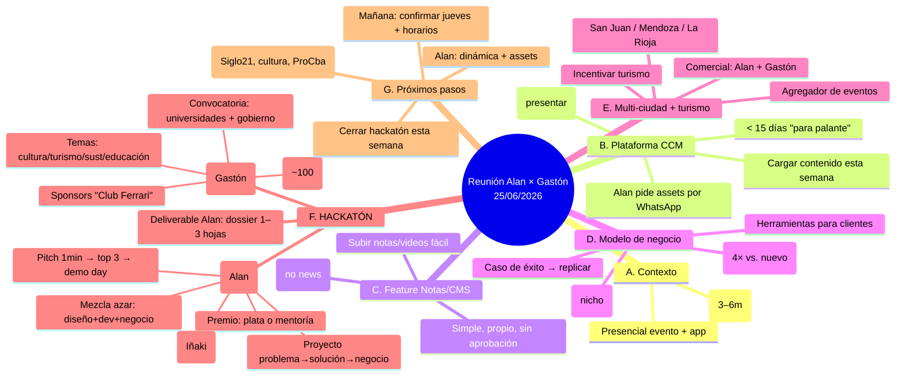

# 📞 Notas de producto — Reunión Alan × Gastón (25/06/2026)

> **Participantes:** Alan Tapia (producto/dev) · Gastón Santana (CCM / agencia Mabel)
> **Canal:** audios de WhatsApp (transcripción) · **Duración:** ~1h03
> **Propósito de este doc:** categorizar y diagramar la charla para bajar decisiones y features de producto. Notas de trabajo (no acta literal).

---

## 🗂️ Categorías

### A. Contexto / relación
- **🔴 Alan se muda a Córdoba** — 95% confirmado, **desde el 15 de agosto de 2026**, por **3–6 meses** (hasta ~diciembre). Va a estar **presencial** para el evento, la app y otros proyectos conjuntos. Se coordinan apenas llegue.
- Gastón viene de un día intenso: clientes con problemas (cambios de fechas, ticketera, publicidad), uno nuevo enganchado con reunión de urgencia en el hotel. Contexto de agencia en modo "apagar incendios".

### B. Plataforma CCM (app) — reunión y avances
- **📅 Reunión oficial el JUEVES** (primera presentación en conjunto): ver la plataforma + hablar en general de **app + hackatón**. Alan muestra avances "optimizados y refactorizados".
- Meta: en **< 15 días** tener "la para palante" (lista para mostrar/avanzar).
- **Contenido a cargar esta semana:** fotos de eventos pasados, videos, notas. Alan va a **pedir por WhatsApp lo que necesita sí o sí** — para ir cargándolo, ver **peso de las fotos**, detectar errores y "cómo impacta" (muestrario).
- El **diseño** ya lo pasó Gastón; a Alan le gustó.

### C. 🧩 Feature: Notas / Contenido (CMS simple) — requerimiento de Gastón
- Gastón quiere **subir notas y videos fácil**, que lo haga **cualquiera del equipo (no un periodista)**.
- **NO es un canal de noticias**: es **curar y rotar** contenido — "hoy mostramos esta nota, la próxima otra", elegir cuál se muestra, subir nueva. Simple, de **nicho**, propio.
- Dolor de referencia: en Cadena 3 / Canal 12 el proceso es engorroso (mandar archivo, aprobación externa). Ellos quieren algo **simple, propio, sin aprobación de terceros** — "creado por nosotros".
- ✅ *Nota: esto ya está implementado como la feature "notas/CMS" en prod — este audio es la fuente del requerimiento.*

### D. 💡 Modelo de negocio / lectura de mercado (insight de Gastón)
- **Target = empresas "del medio" (mid-market)**, no las grandes nacionales. Nicho → más fácil de vender y hay muchas más (casi toda agencia argentina vive de las medianas).
- **Tendencia acelerada por la crisis: foco en VENTA y RETENCIÓN.** Conseguir un cliente nuevo cuesta **4×** → hay que **cuidar al que ya compró**.
- Las empresas hacen **charlas y activaciones** para retener clientes y **necesitan herramientas**. Gastón hoy **no les ofrece nada** (salvo lo del evento propio) → oportunidad.
- **Ecosistema:** la gente va ~2 veces al teatro (no 10). Capturar ese caudal en "su mundo/ecosistema". Emprendedores con 3–4 compañías, grupos de teatro, funciones diarias en temporada.
- **Caso de éxito:** si la plataforma funciona en el evento **con métricas**, se **replica y vende** a otros. Post-evento (mes siguiente): juntarse con todos, mostrar métricas, salir a vender.

### E. 🌎 Visión multi-ciudad / multi-evento + turismo
- **Replicar la plataforma** a otros eventos y ciudades: **San Juan, Mendoza, La Rioja**.
- **Incentivar el turismo desde la app** → venderle a provincias que viven del turismo.
- **Ejemplo Uruguay:** eventos patrocinados por gobierno/directivos; el argentino mueve **~70% del PBI turístico** uruguayo; el problema era que el argentino **no tenía conocimiento/acceso** a los eventos → la app resuelve **"todo en un mismo lugar"**.
- 🧩 **Feature implícita — agregador/directorio de eventos de una ciudad:** que el emprendedor **suba sus eventos** y la gente común **vea todos los eventos** que hay. Gastón: *"eso amaríamos tener… no existe… vos tenés 3 [eventos]"*.
- La **parte comercial** la trabajan Alan + Gastón juntos.

### F. 🚀 HACKATÓN ("jacatón") — iniciativa grande a estructurar
**Estado:** idea sin estructura. Gastón necesita el **"cómo armarlo y dónde"**. Fue a hackatones (San Juan, UTN Bs As) con formatos opuestos (uno todos con compu, otro sin ninguna) → no tiene claro el concepto. Patrocinado en el marco del **hotel** (que patrocina la app).

**🅰️ Dinámica — la arma ALAN (la tiene clara):**
- Mezclar **al azar**: diseñadores + programadores + perfil de negocios → **grupitos** (que no se conozcan).
- X minutos para mezclarse/armar grupos. **1 computadora por grupo** (o 2).
- Crear un **PROYECTO (problema → solución → negocio)** en tiempo determinado.
- **Pitch de 1 minuto** por proyecto (a reloj). De ~20 proyectos → se eligen **3**.
- Los 3 finalistas: **"demo day"** — Q&A tipo **inversionista** (preguntas concretas, ida y vuelta). Gana **1**.
- **Premio simbólico:** dinero para crear el proyecto **o** asesoramiento privado con un fundador/emprendedor.
- Referencias: **São Paulo, cripto/Ethereum** (AWS da US$5k, mentorías). Poco explotado en Argentina.
- **Charlas previas:** cómo crear una startup · usar **IA para programar** · modelo de negocio · cómo pitchear. Oradores: **Iñaki** (negocio, ya disponible/quiere estar), **Alan** (startup) + 3–4 personas de ángulos distintos (ej. huella de carbono, robótica).

**🅱️ Encuadre — lo pone GASTÓN (para meter clientes de gobierno):**
- **Tema/excusa:** cultura, arte, diseño, **turismo**, **sustentabilidad**, educación (los rubros de sus clientes con plata: **gobierno** cultura/turismo).
- Los ~20 problemas del hackatón deben **atarse a esos temas** (no "vender ruedas"); el #20 puede ser libre.
- **Convocatoria:** universidades (**Siglo 21, Blas Pascal, UCC** — carreras de tecnología/diseño/turismo), **gobierno** (secundaria 5°/6°, estudiantes), redes, convocatoria abierta. **Cada área de gobierno necesita su "excusa" temática** para convocar.
- **Contactos:** cultura, turismo (**Darío Capitán**, aliado a radio), sustentabilidad; **Miguel Siciliano** (polideportivos $250M, no encaja fácil); **Néstor** (amigo), **Nicolás** (jefe); Siglo 21 (contacto de venta de tecnología en gobierno).
- **Sponsors — analogía "Club Ferrari":** traer a las **personas indicadas** (dueños/empresarios "de avión privado") **gratis y tratados como reyes**; ellos **traen a los demás** → se arma solo. "En el momento que hago algo, traigo a los indicados y ellos traen las otras."
- **Timing:** 2026 es **año de elecciones** → si son rápidos, oportunidad (presupuestos).

**📍 Venue:** **restaurante del Hotel Quinto Centenario** (grande, hoy vacío). Capacidad **~60–150** según mesas (objetivo ~**100**). Gastón corrobora capacidad el **viernes/lunes**.

**📄 Deliverable de ALAN:** un **dossier / PDF de 1–3 hojas** con: la **estructura** del hackatón, la **dinámica**, **qué se necesita** (logística: banquetas, generador, pantalla, sonido), **cómo convocar y a quién**. Para el **jueves** Alan presenta la dinámica; **cerrar la idea esta semana** para que Gastón salga a venderla.

---

## 🗺️ Diagrama de la conversación

---

## ✅ Acciones / próximos pasos

| # | Acción | Dueño | Cuándo |
|---|--------|-------|--------|
| 1 | Escribir a Gastón si el jueves está resuelto + tirar horarios | Alan | Mañana (26/06) |
| 2 | Mandar por WhatsApp la lista de **contenido/assets** que necesita (fotos, videos, notas) | Alan | Esta semana |
| 3 | Armar la **dinámica del hackatón** + **dossier 1–3 hojas** (estructura, logística, convocatoria) | Alan | Para el jueves |
| 4 | Presentar la **plataforma + dinámica** en la reunión | Alan | Jueves |
| 5 | Reuniones para el encuadre: **Siglo 21** (diseño, mañana), **cultura/arte** (viernes), **Pro Córdoba** y otras | Gastón | Esta semana |
| 6 | **Corroborar capacidad** del restaurante del Quinto Centenario | Gastón | Viernes/Lunes |
| 7 | **Cerrar la idea del hackatón** (para salir a vender) | Alan + Gastón | Esta semana |
| 8 | Post-evento: juntar clientes, **mostrar métricas**, vender la plataforma a otros eventos/ciudades | Alan + Gastón | Mes post-evento |

---

## ❓ Preguntas / decisiones abiertas (para product)
- **Agregador de eventos de ciudad:** ¿entra en el roadmap de la app como feature (directorio público de eventos + carga por emprendedor)? Gastón lo pidió explícito ("no existe, lo amaríamos tener").
- **Hackatón:** ¿tema/eje final? (cultura + turismo + sustentabilidad + educación) → define convocatoria y los ~20 problemas.
- **Premio del hackatón:** ¿plata para el proyecto o mentoría? ¿monto? ¿quién lo banca (sponsor/gobierno/hotel)?
- **Multi-ciudad:** ¿se prioriza post-evento como producto vendible (con métricas) o antes?
- **Métricas:** definir qué métricas del evento se capturan para el "caso de éxito" comercial.

---
*Fuente: transcripción de audios WhatsApp 25/06/2026. Ver estado técnico del proyecto en [`../ESTADO-ACTUAL.md`](../ESTADO-ACTUAL.md) y [`../../PROJECT.MD`](../../PROJECT.MD).*
